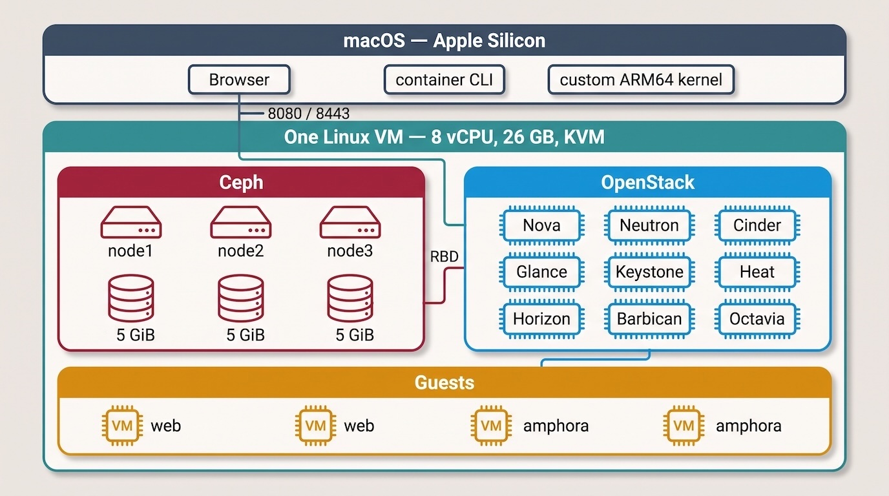
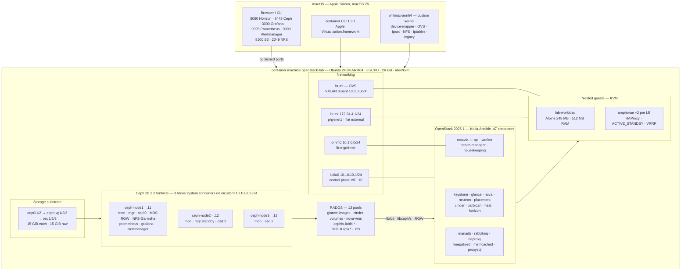

# OpenStack & 3-node Ceph lab on Apple Silicon

A complete, restart-proof OpenStack cloud backed by a 3-node Ceph cluster, running
inside a single Apple `container` machine on an M-series Mac. Three scripts build it;
two guides explain it; 29 day-2 exercises give you something to do with it.

This is a lab, not a production reference. It is sized to fit on one laptop and every
shortcut it takes is stated in the build guide.



## What you get


- **Ceph 20.2.2 (tentacle)** deployed by `cephadm` into Incus system containers, on
  LVM-backed loop devices — 3 mons, 3 OSDs, 15 GiB raw, MDS, RGW
- **OpenStack 2026.1** via Kolla-Ansible `stable/2026.1`: Keystone, Glance, Nova,
  Neutron, Placement, Cinder, Barbican, Heat, Horizon
- **Everything on Ceph RBD** — Glance images, Cinder volumes, Nova root disks
- **S3** through Ceph RGW, and **NFSv4.1** through CephFS + NFS-Ganesha
- **Neutron ML2/OVS** with a flat external network on `br-ex` and VXLAN tenant
  networks, so floating IPs work from macOS
- **Octavia load balancing** in `ACTIVE_STANDBY`, with an amphora image built for
  aarch64 — no prebuilt one exists
- Survives a machine restart, including device renumbering

## Architecture



Floating IPs on `172.24.4.0/24` live behind `br-ex` and are **not** routable from
macOS — `lab-expose <port> <floating-ip>` publishes one on the VM's address when you
want to open a workload in your own browser.

## Requirements

| | |
|---|---|
| Hardware | Apple Silicon M3 or later |
| macOS | 26 |
| Tooling | Apple [`container`](https://github.com/apple/container) CLI 1.3.1+ |
| Memory | 26 GB to the machine by default; 24 GB works with `ENABLE_NETWORK_LOADBALANCER=no`, 32 GB on a 48 GB Mac |
| Disk | ~55 GB free. Measured peak 50.7 GB on a full run of all 29 exercises |
| Time | About 70 minutes end to end: 2 min kernel, 8 min image, 26 min provision, 34 min exercises |

`MACHINE_CPUS` and `MACHINE_MEMORY` in `02-build-image.sh` set the machine's size.

## Quick start

```bash
git clone https://github.com/kovjanos/openstack-ceph-lab.git
cd openstack-ceph-lab

./01-build-kernel.sh     # macOS. Produces vmlinux-arm64, then cleans up after itself.
./02-build-image.sh      # macOS. Builds the image and creates the machine.
container machine run -n openstack-lab --root -- /usr/local/sbin/provision-lab.sh
```

The third script runs inside the VM and is baked into the image, so after logging in
(`container machine run -n openstack-lab`, then `sudo -i`) you can just run
`provision-lab`.

**Network load balancing is on by default, and the machine defaults to 26 GB to
accommodate it.** The four Octavia containers cost 1.4 GB all the time — ordinary here,
where `neutron_server` alone is 0.9 GB — and the two amphorae cost 2 GB more, but only
while exercises 9–11 are running.

It runs on 24 GB: measured peak was 19.9 GB, leaving 4.2 GB. That works, but it is thin
if anything else on the machine is busy, so 26 GB is the default rather than the
minimum.

**If you need to run on 24 GB**, build without it:

```bash
ENABLE_NETWORK_LOADBALANCER=no provision-lab
```

Everything except exercises 9–11 is unchanged, and Exercise 9 still teaches round-robin
and sticky sessions using HAProxy in a guest.

It costs one-off resources too: about 3 minutes to build the amphora image, and 7.5 GiB
of the 15 GiB Ceph cluster once it is in Glance (2.5 GiB raw, charged at `size = 3`).

The service behind it is OpenStack's Octavia, which is what the settings and error
messages say; the flag names the capability so you do not have to know that first.

It is checkpointed per phase under `/var/lib/openstack-lab/state`, so a failed run
resumes where it stopped:

```bash
provision-lab --list             # phases and their state
provision-lab --from 50-ceph     # re-run from a phase onward
provision-lab --only 90-verify   # print the current URLs and passwords
```

`--only 90-verify` is also how you get back in after a restart — **the machine's IP
address changes every time it starts**, so read it fresh rather than reusing an old
one.

## Repository layout

| Path | What it is |
|---|---|
| `01-build-kernel.sh` | Builds `vmlinux-arm64` from `apple/containerization`. The stock kernel has no device-mapper, which makes LVM — and therefore Ceph — impossible. |
| `02-build-image.sh` | Builds `local/ubuntu-machine:latest` and creates the `openstack-lab` machine. Everything needed at boot is baked into the image. |
| `03-provision.sh` | Runs in the VM. Eleven checkpointed phases from loop devices to a verified cloud. |
| `sync-provision.sh` | Pushes an edited `03-provision.sh` into the machine without rebuilding the image. |
| `openstack-ceph-lab-build.md` | The build guide: every phase, why it is done that way, and what breaks otherwise. |
| `test/` | End-to-end verification: rebuilds the lab and runs all 29 exercises, recording disk and memory per step. See [`test/README.md`](test/README.md). |
| `openstack-ceph-lab-exercise.md` | 29 day-2 exercises, each with a real incident behind it, CLI steps, the web-UI equivalent, and cleanup. |
| `walkthrough/` | Screenshots of the web-UI side of every exercise, one Markdown file per exercise. |

Both build scripts delete the BuildKit cache as their last step. That is not
housekeeping for its own sake — BuildKit is a persistent container with a 42 GB ext4
rootfs and no cache eviction, and it is where most of the 129 GB this lab once
occupied had accumulated.

## The exercises

`openstack-ceph-lab-exercise.md` is the reason the lab exists. Each exercise opens
with the day-2 situation it covers, so you know why you are doing it:

| Part | Exercises |
|---|---|
| A. Foundation | bootstrap the tenant · build the lab image |
| B. One workload | first workload · persistent disk · snapshot & restore · grow a volume |
| C. Two workloads | network isolation · floating-IP failover |
| D. Load balancing † | one address two servers · sticky sessions · the load balancer died |
| E. Shared storage | shared NFS · object storage |
| F. Platform operations | encrypted volumes with Barbican · Heat · quotas · projects & RBAC |
| G. Ceph day-2 | RADOS underneath it all · maintenance mode · restricted credentials · adding a disk · failure drill · disk replacement · CephFS snapshots · replication cost · scrub · monitoring · decommissioning a disk |
| H. Recovery | recovering a cluster that has filled up |

† Part D needs the load-balancer build, which is on by default — see below. Built
without it, the end of Exercise 9 teaches round-robin and sticky sessions using HAProxy
in a guest instead.

Peak cost is two 512 MB guests, or two guests plus two 1 GB amphorae across Part D. The lab image is a 248 MB Alpine build, not a distro
cloud image — Exercise 2 explains why and how it is made.

[`walkthrough/`](walkthrough/README.md) has the same exercises driven through Horizon
and the Ceph dashboard, with screenshots of each step.

## Getting in

```bash
# a shell in the machine
container machine run -n openstack-lab

# run something headless (the only form that works from a background job)
container machine run -n openstack-lab --root -- /usr/local/sbin/provision-lab.sh
```

Inside the VM, the OpenStack client needs this wrapper:

```bash
OS() { sudo -u kolla bash -lc '. /opt/kolla/venv/bin/activate && \
  OS_CLIENT_CONFIG_FILE=/etc/kolla/clouds.yaml OS_CLOUD=kolla-admin exec openstack "$@"' _ "$@"; }
```

The trailing `_ "$@"` matters. Interpolating `$*` into the quoted string loses quoting,
and any argument containing a space is silently split.

Ceph commands go through `incus exec ceph-node1 -- cephadm shell --`.

## Web UIs

| UI | URL | Login | Covers |
|---|---|---|---|
| Horizon | `http://<vm-ip>:8080/` | `admin`, domain `Default` | compute, network, volumes, **load balancers**, Heat, identity |
| Ceph dashboard | `https://<vm-ip>:8443/` | `admin` | hosts, OSDs, pools, CephFS, object gateway, logs, alerts |
| Grafana | `https://<vm-ip>:3000/` | none — anonymous viewing | ~20 pre-built Ceph dashboards; also embedded in the Ceph dashboard |
| Prometheus | `http://<vm-ip>:9095/` | none | scrape targets and a PromQL query browser |
| Alertmanager | `http://<vm-ip>:9093/` | none | alert state behind the dashboard's Alerts page |

Every address and every password is printed by `provision-lab --only 90-verify`.

**Your own workloads are not on this list, and that is the one gap worth knowing.**
Instance floating IPs (`172.24.4.x`) live behind `br-ex`, and macOS has no route to
them — it sends that range to your LAN gateway instead. The management UIs above are
reachable because each is explicitly forwarded; a web server you launch in an exercise
is not. To open one in a browser on the Mac:

```bash
lab-expose 18080 172.24.4.20     # inside the VM; then open http://<vm-ip>:18080/
lab-expose --list                # what is published
lab-expose --clear               # remove them
```

`provision-lab --only 90-verify` prints this too. A `sudo route -n add -net
172.24.4.0/24 <vm-ip>` on the Mac is the alternative and makes floating IPs work
directly, but it needs sudo, does not survive a reboot, and points at an address that
changes on every machine start.

**Load balancing does not add a UI of its own.** It appears inside Horizon under
Project → Network → Load Balancers, with a five-step create wizard covering listener,
pool, members and monitor in one pass. The Octavia API is on port 9876 but bound to the
internal VIP behind haproxy, so it is not reachable from macOS and there is nothing to
open there — it is a REST API, not a dashboard. The amphorae are likewise invisible in
Horizon: they live in Octavia's own service project, and `openstack loadbalancer
amphora list` is the only view of them.

The monitoring stack is what `cephadm` deployed at bootstrap — nothing extra is
installed. The Ceph dashboard embeds Grafana's panels, so open `https://<vm-ip>:3000/`
once and accept its certificate before using any "Overall Performance" tab; it is a
different self-signed certificate from the dashboard's.

## License

Two licenses, split by what the file is:

- **Documentation, guides, walkthrough text and screenshots** — [CC BY 4.0](LICENSE).
  Use, share and adapt them anywhere, including commercially, as long as you credit the
  source.
- **Scripts (`*.sh`)** — [MIT](LICENSE-CODE).

Both require attribution. See [LICENSE](LICENSE) for how to credit.
