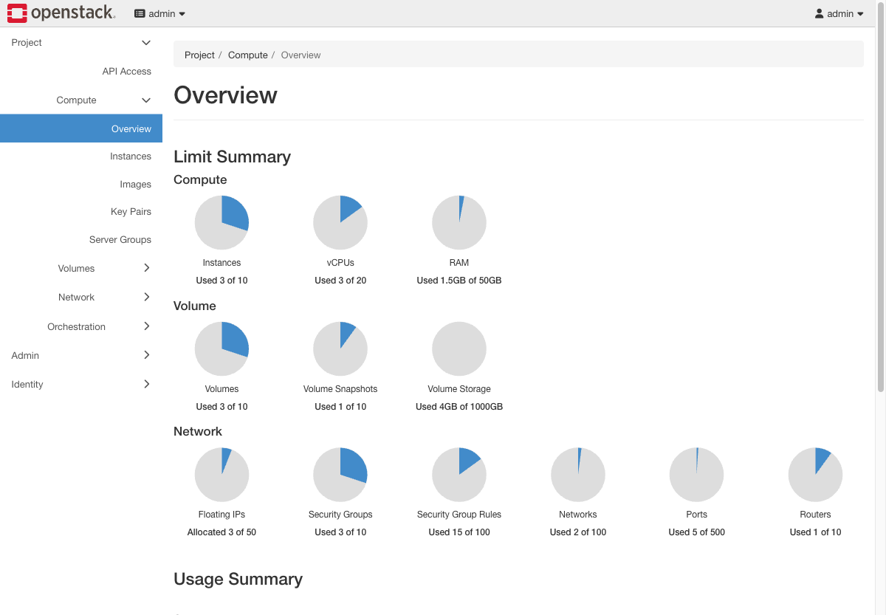
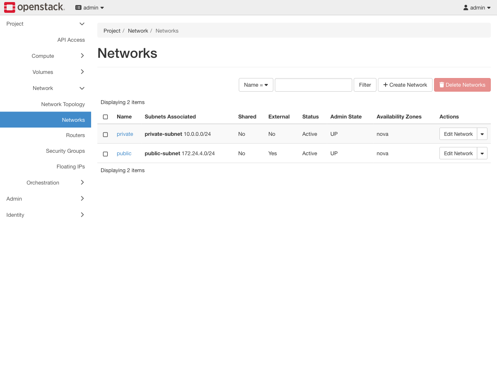
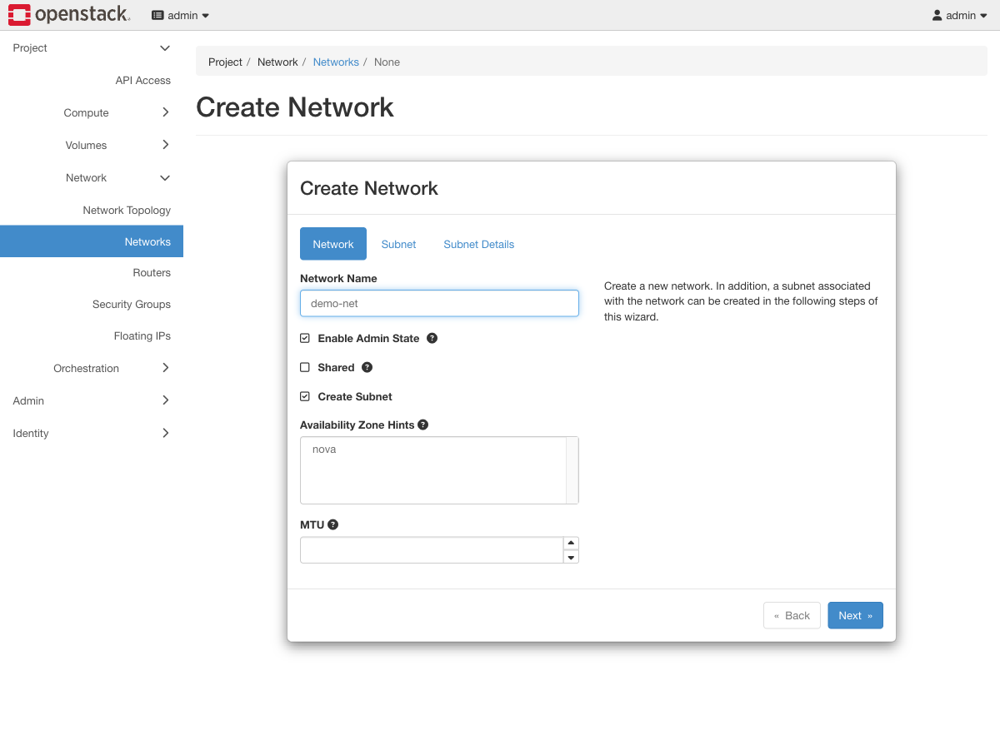
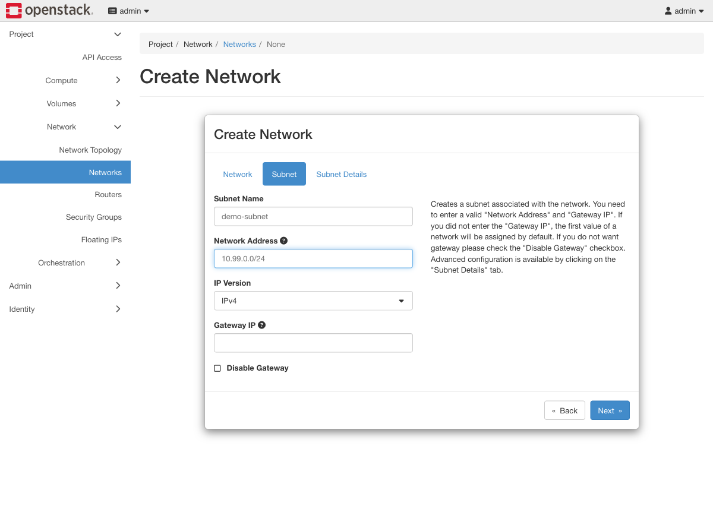
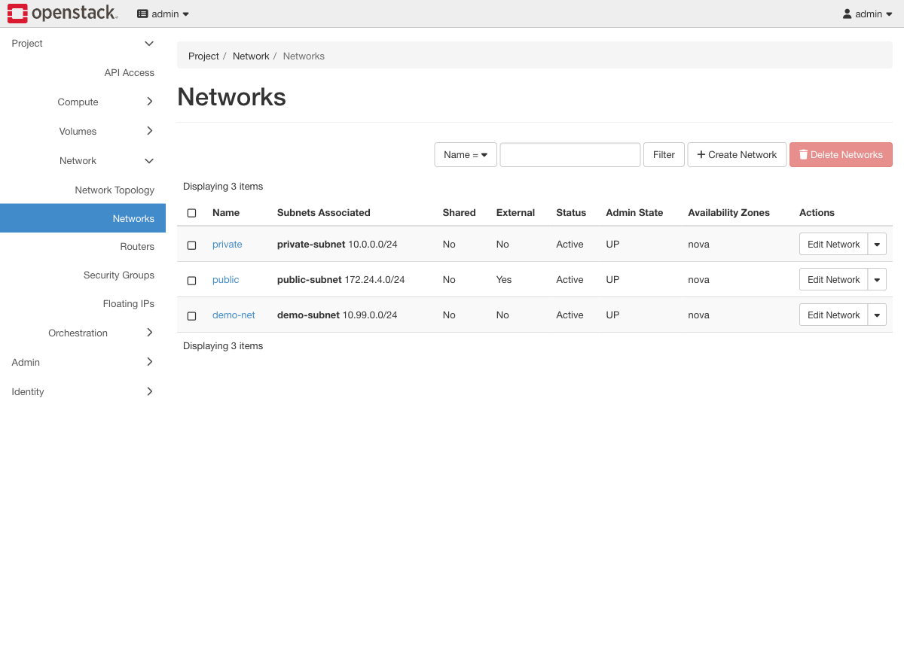
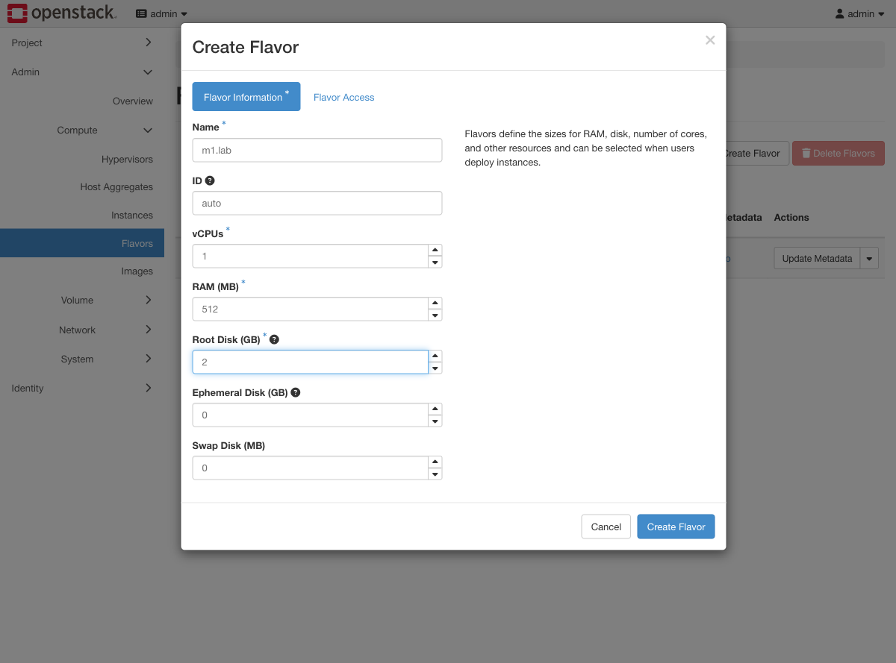
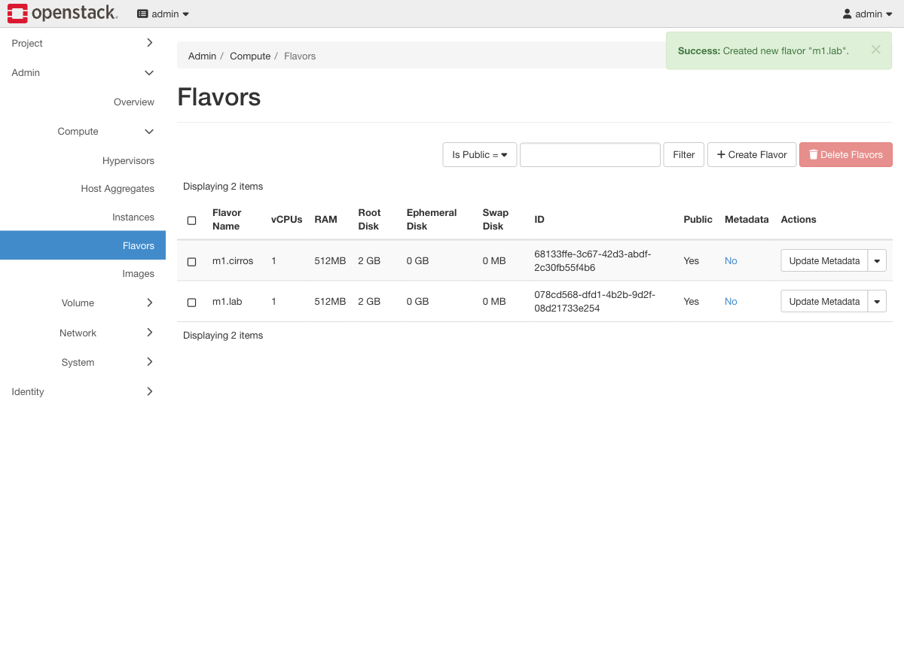
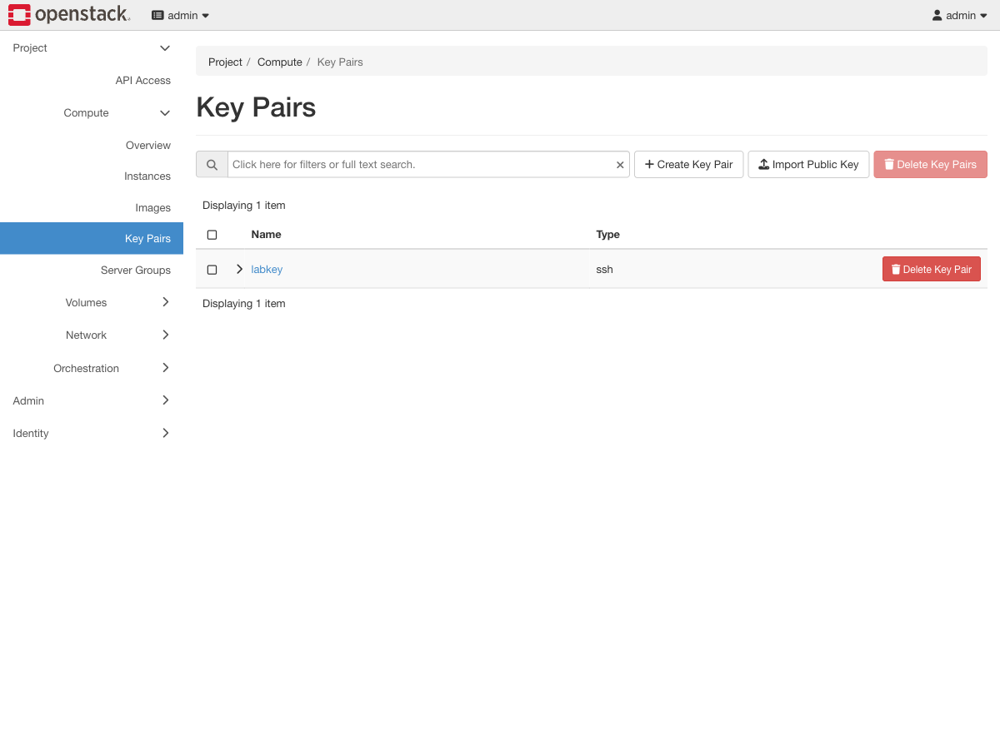
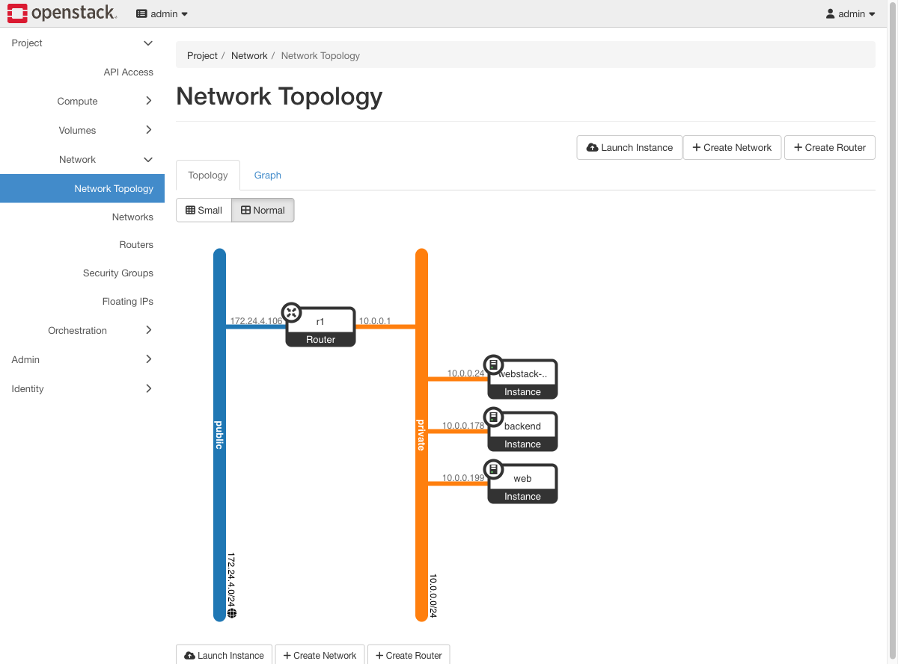

# Exercise 1 — Bootstrap the tenant (web UI)

Guide section: [Exercise 1](../openstack-ceph-lab-exercise.md#exercise-1--bootstrap-the-tenant)

A freshly deployed cloud has no network, no flavor and no key, so the first
`server create` fails. This is what building those looks like in Horizon.

## Step 0 — Log in and read the limits

`http://<vm-ip>:8080/` → `admin` / the password printed by `--only 90-verify`,
domain `Default`. You land on **Project → Compute → Overview**.

The Limit Summary is worth a glance now: everything is at zero, and by Exercise 13 you
will come back here to read a quota that has run out.

## Step 1 — Networks

**Project → Network → Networks.**

## Step 2 — Create Network, first tab

**Create Network** opens a three-tab wizard. The first tab is just the name.

## Step 3 — Subnet

**Next** moves to the subnet. Name and CIDR are the only required fields; leave
Gateway IP blank to get the first address of the range.

The third tab, Subnet Details, holds DHCP, DNS servers and allocation pools — the
things the CLI passes as `--dns-nameserver` and `--allocation-pool`.

## Step 4 — The result

`public` shows **External: Yes**. That flag needs admin rights, which is why the guide
creates the external network under **Admin → Network → Networks** with "External
Network" ticked, not here.

## Step 5 — Flavors

**Admin → Compute → Flavors → Create Flavor.** 512 MB is the floor for this lab's
image; 128 MB fails in the aarch64 UEFI bootloader before Linux ever starts.

## Step 6 — Key pairs

**Project → Compute → Key Pairs.** Creating one here downloads the private key through
the browser — the only time you can retrieve it.

## Step 7 — Check the shape of it

**Project → Network → Network Topology** draws what you just built: the two networks,
the router joining them, and (later) every instance hanging off `private`.

This view is the fastest way to answer "is this instance actually attached to
anything?" during the later exercises.
