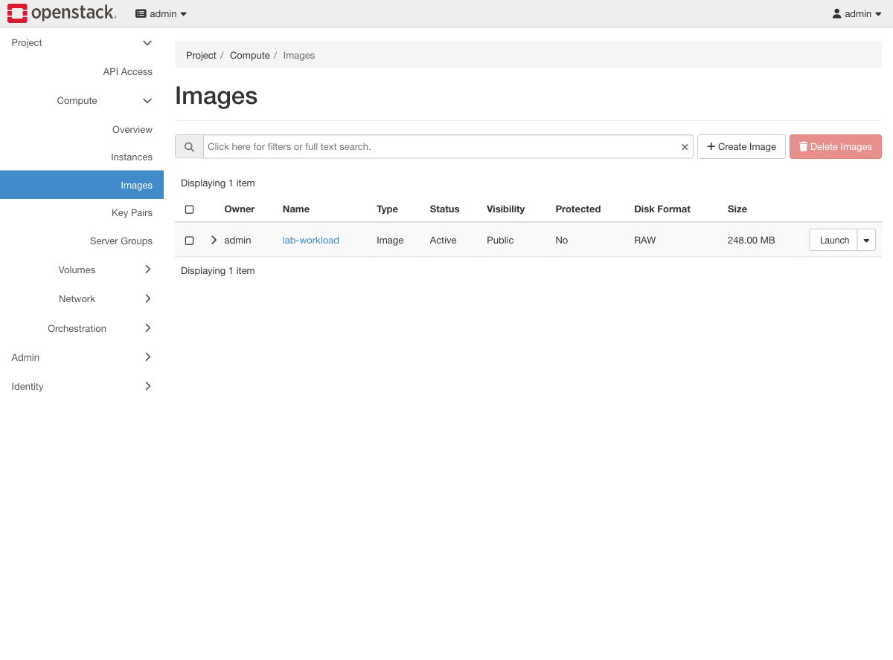
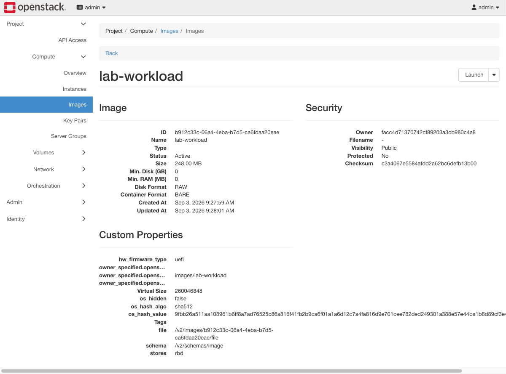

# Exercise 2 — Build the lab's own image (web UI)

Guide section: [Exercise 2](../openstack-ceph-lab-exercise.md#exercise-2--build-the-labs-own-image)

Building the image is a shell job — `qemu-img`, `virt-customize` and `openstack image
create` — and Horizon has no part in it. What Horizon is good for is checking the
result, which is the part people skip and then debug for an hour.

## Step 1 — The image list

**Project → Compute → Images.**

One image. If you see a second one left over from an earlier attempt, delete it now —
a stale image is the usual reason an instance boots something other than what you
expected.

## Step 2 — The properties that matter

Click the image name.

Four things to check here, all of which are silent failures if wrong:

- **Size 248.00 MB** — this is the whole point of building it. A stock distro image is
  3.5 GB and buys you nothing this lab needs.
- **Disk Format RAW** — Cinder and Nova on RBD want raw. QCOW2 works but forces a
  conversion on every boot.
- **stores: rbd** — the image lives in Ceph, not on the controller's disk.
- **hw_firmware_type: uefi** — aarch64 has no BIOS path. Without this the instance
  never reaches a bootloader.

The `datasource_list` fix from the guide is inside the image, not a property, so it is
not visible here. The evidence for that one shows up in Exercise 3's console log.
