# Exercise 3 — A first workload (web UI)

Guide section: [Exercise 3](../openstack-ceph-lab-exercise.md#exercise-3--a-first-workload)

"It says ACTIVE but I can't reach it" is the most common ticket in any cloud. You
cannot debug someone else's instance until you have booted a known-good one yourself.
The Launch Instance wizard is where every field of `openstack server create` lives.

## Step 1 — Details

**Project → Compute → Instances → Launch Instance.**

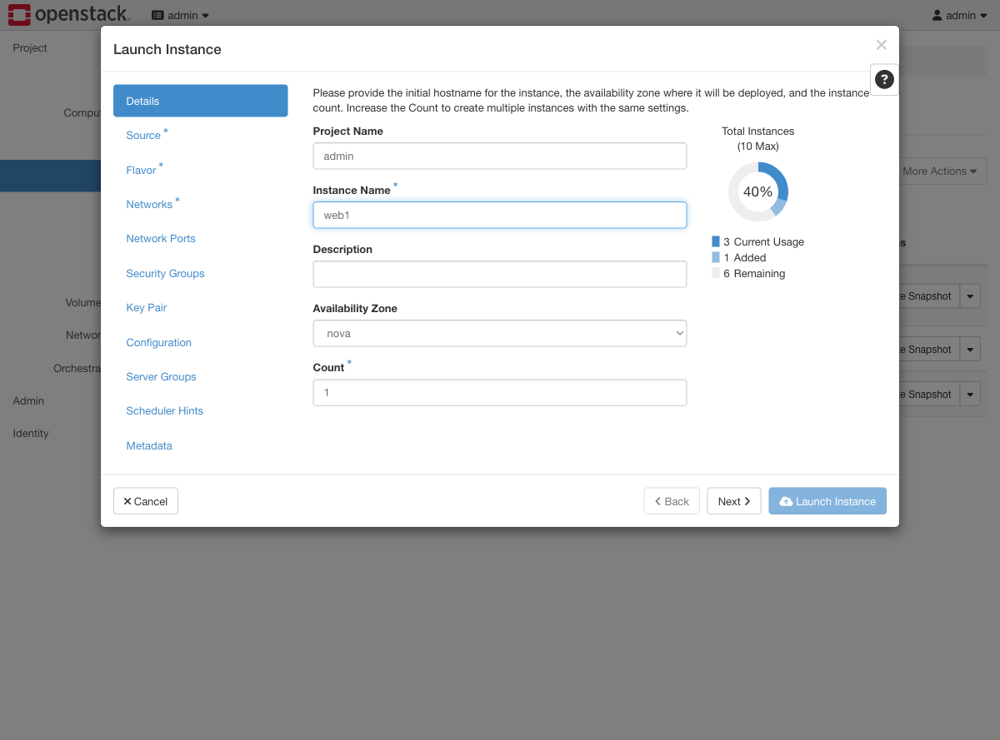

The quota donut on the right updates as you go. It is the same number Exercise 16
deliberately exhausts.

## Step 2 — Source

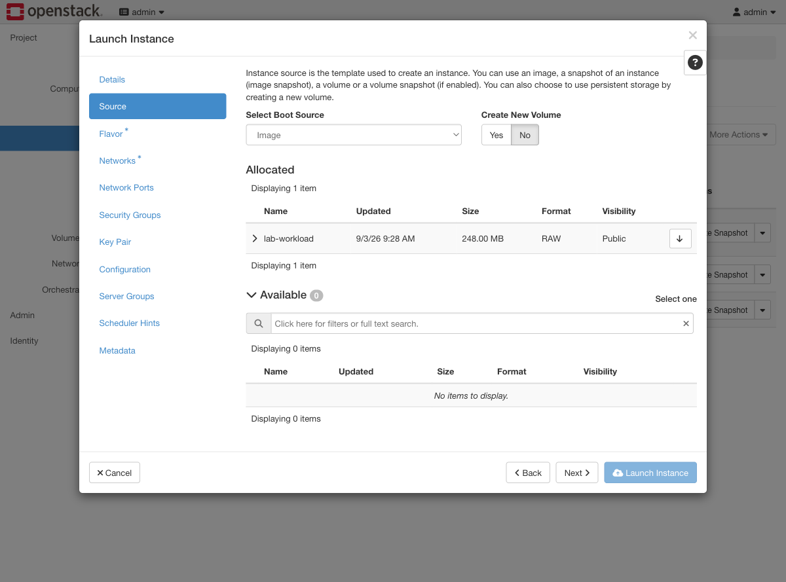

**Set "Create New Volume" to No.** The default is Yes, which boots the instance from a
new Cinder volume instead of an ephemeral disk. That works, but it consumes volume
quota and leaves a volume behind on delete — not what the guide's `server create` does.

Then click the ↑ on `lab-workload` to move it into **Allocated**. Nothing is selected
until it is in that top table.

## Step 3 — Flavor

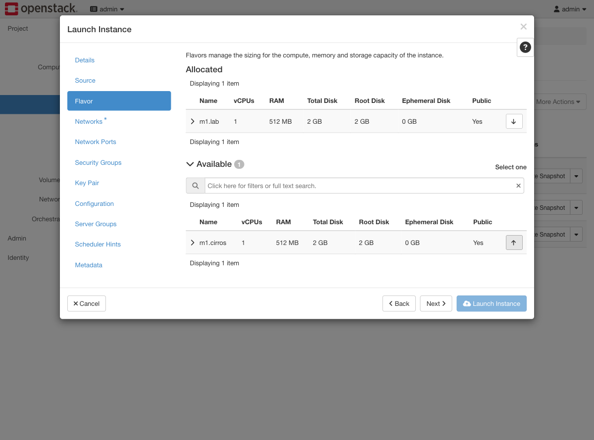

## Step 4 — Networks

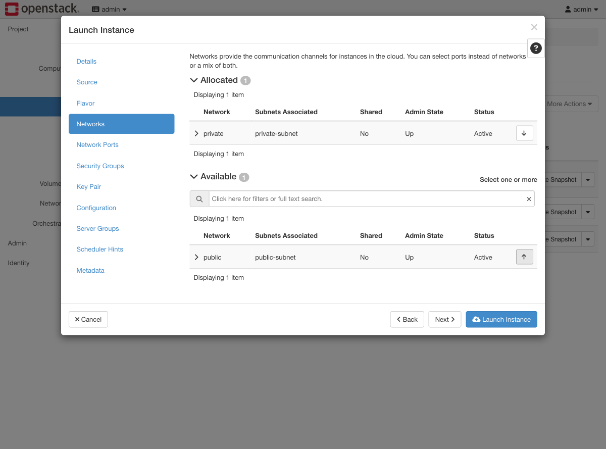

`private` only. Attaching directly to `public` skips the router and gives you an
instance that cannot be reached the way the rest of the lab expects.

## Step 5 — Key Pair

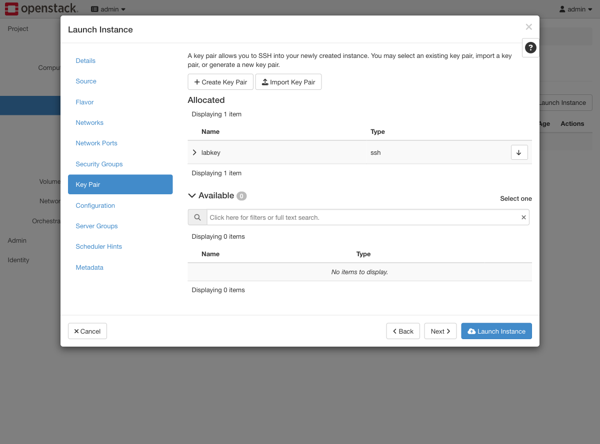

Check the arrow flipped from ↑ to ↓ before moving on. A key pair that was clicked but
not allocated produces an instance with `key_name: None`, and the only symptom is that
SSH asks for a password that does not exist.

## Step 6 — Configuration

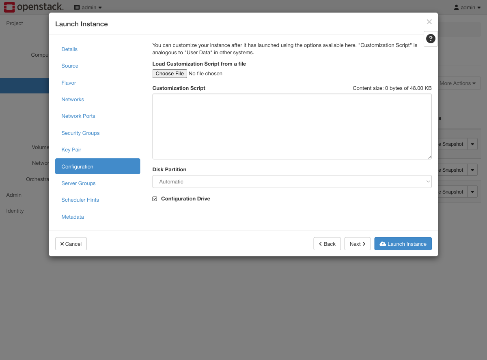

**Configuration Drive** is the checkbox equivalent of `--config-drive true`. This lab
reaches the metadata service over the network so it is not required, but it costs
nothing and removes one failure mode.

## Step 7 — Running

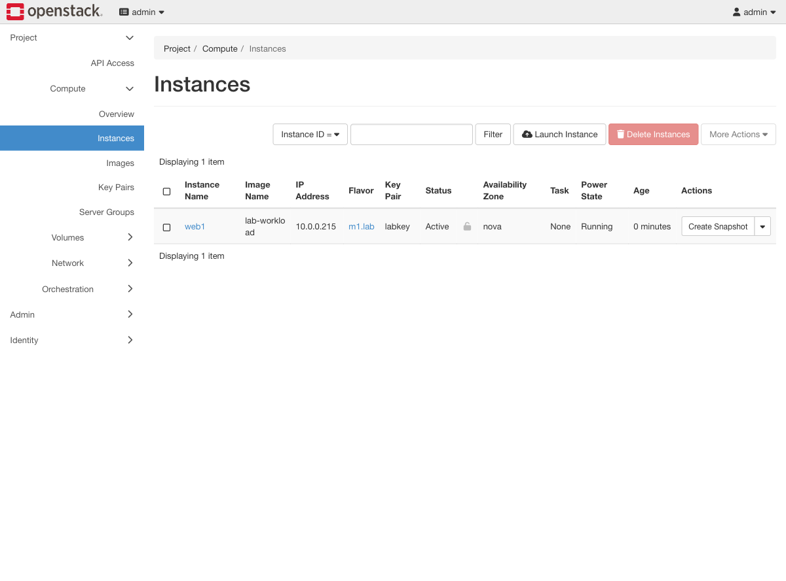

## Step 8 — Give it an address

The instance dropdown carries everything you would otherwise do with `openstack server
...` — floating IPs, volumes, metadata, security groups, console, resize, rebuild.

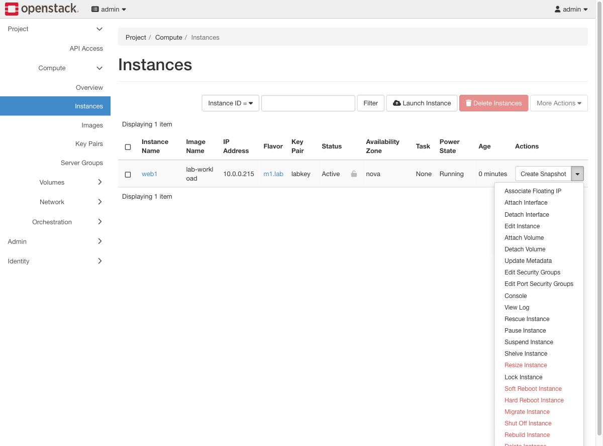

**Associate Floating IP** offers addresses already allocated to the project. If the
list is empty, allocate one first under **Project → Network → Floating IPs**.

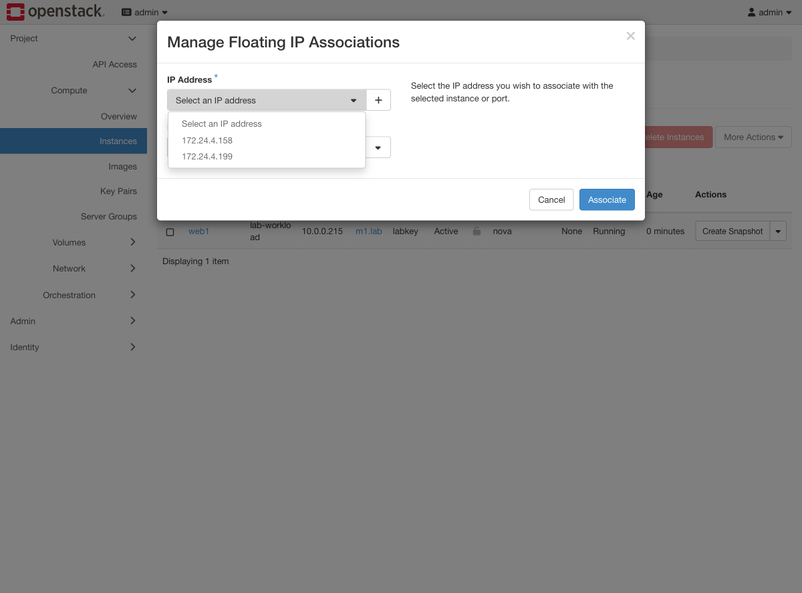

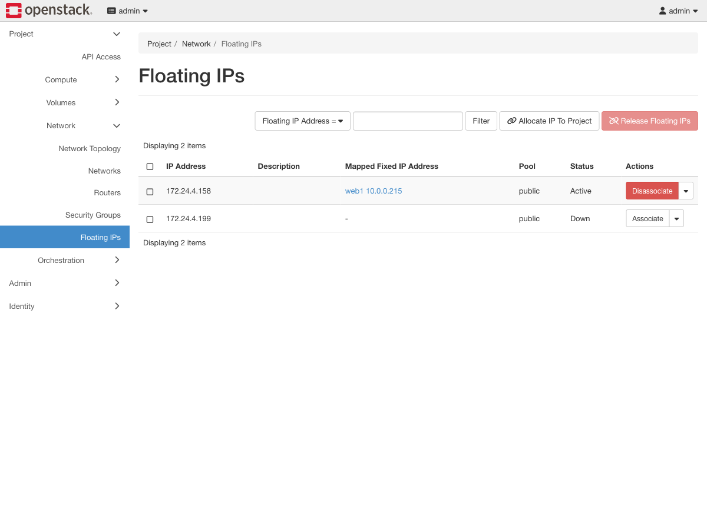

## Step 9 — Read the console before anything else

Instance → **Log** tab. This is `openstack console log show`, and it answers the
"ACTIVE but unreachable" ticket faster than anything else.

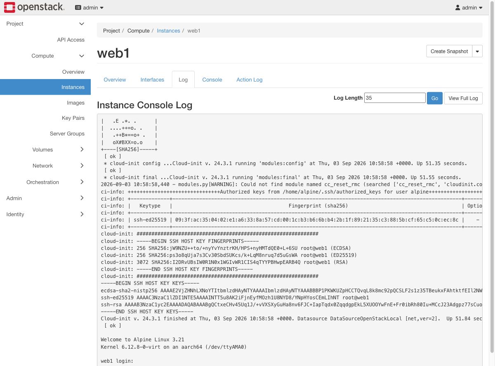

Three lines prove the boot was healthy:

- `Authorized keys from /home/alpine/.ssh/authorized_keys for user alpine` — cloud-init
  injected the key, so SSH will work.
- `Datasource DataSourceOpenStackLocal [net,ver=2]` — it found the metadata service.
  This is exactly what Exercise 2's `datasource_list` fix bought.
- `web1 login:` — userspace is up.

If the key line is missing, the image's datasource list is wrong. If the login prompt
never appears, look at the flavor's memory before anything else.
