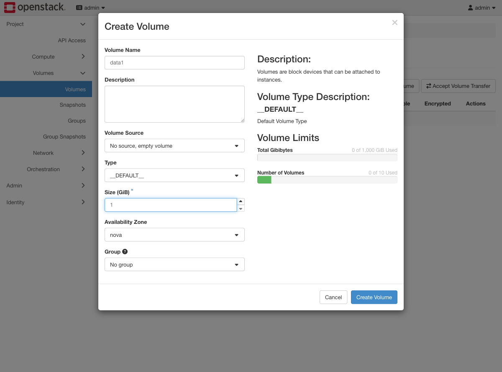
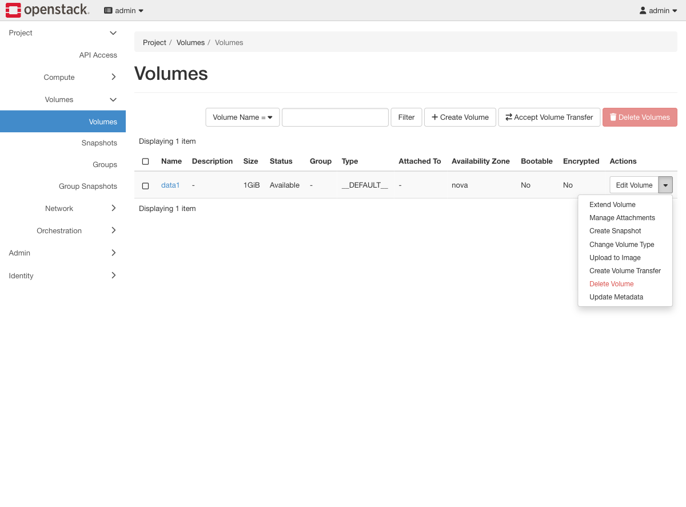
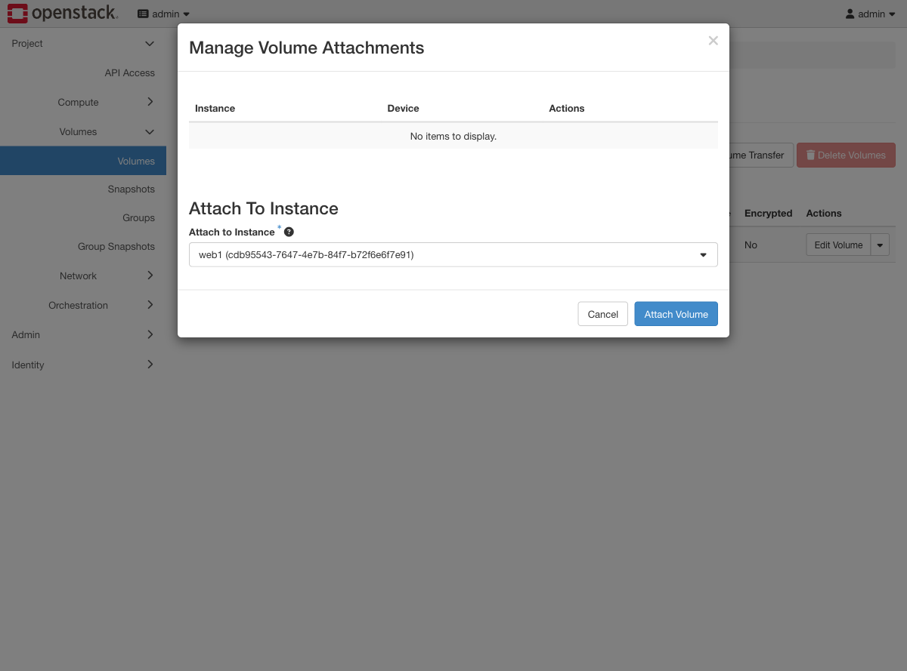
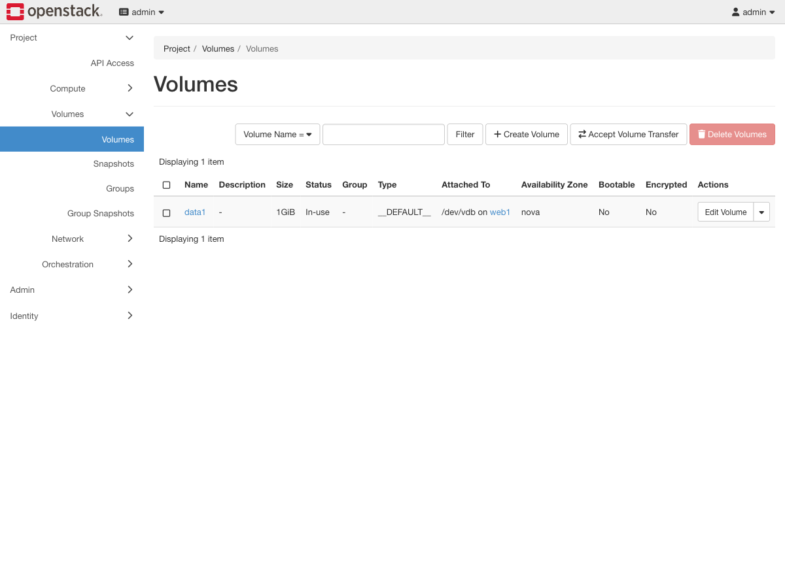
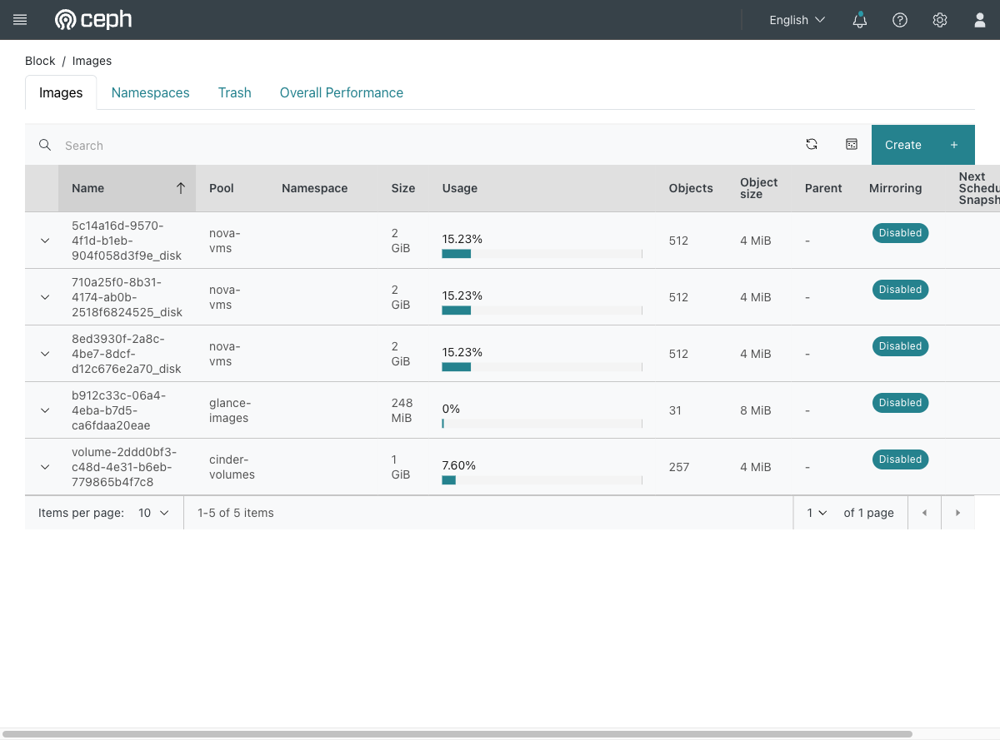

# Exercise 4 — Persistent storage that outlives the instance (web UI)

Guide section: [Exercise 4](../openstack-ceph-lab-exercise.md#exercise-4--persistent-storage-that-outlives-the-instance)

An instance gets deleted and the data on its root disk goes with it. The fix is to
keep state on a volume, which can be detached from one instance and attached to
another.

## Step 1 — Create the volume

**Project → Volumes → Volumes → Create Volume.**

Leave **Volume Source** as "No source, empty volume" and **Type** as `__DEFAULT__`.
Exercise 11 comes back to this dialog to pick the `LUKS` type instead.

## Step 2 — Everything else is on the row dropdown

Extend, Manage Attachments, Create Snapshot and Upload to Image are all here. This one
menu covers Exercises 4, 5 and 6.

## Step 3 — Attach it

**Manage Attachments** → pick the instance → **Attach Volume**.

You cannot choose the device name; Nova assigns it. It came out as `/dev/vdb` here and
will as long as the instance has only a root disk.

## Step 4 — In use

The **Attached To** column reads `/dev/vdb on web1`. Until you make a filesystem and
mount it inside the guest, that is all it is — a raw block device.

## Step 5 — The same volume, seen from the storage side

**Ceph dashboard → Block → Images.**

This is the other half of the exercise. Every Cinder volume is one RBD image in
`cinder-volumes`, named `volume-<uuid>`; every instance's root disk is one in
`nova-vms`; the Glance image is one in `glance-images`. Nothing is hidden — an operator
with cluster credentials can see and read all of it, which is precisely the problem
Exercise 11 solves.
