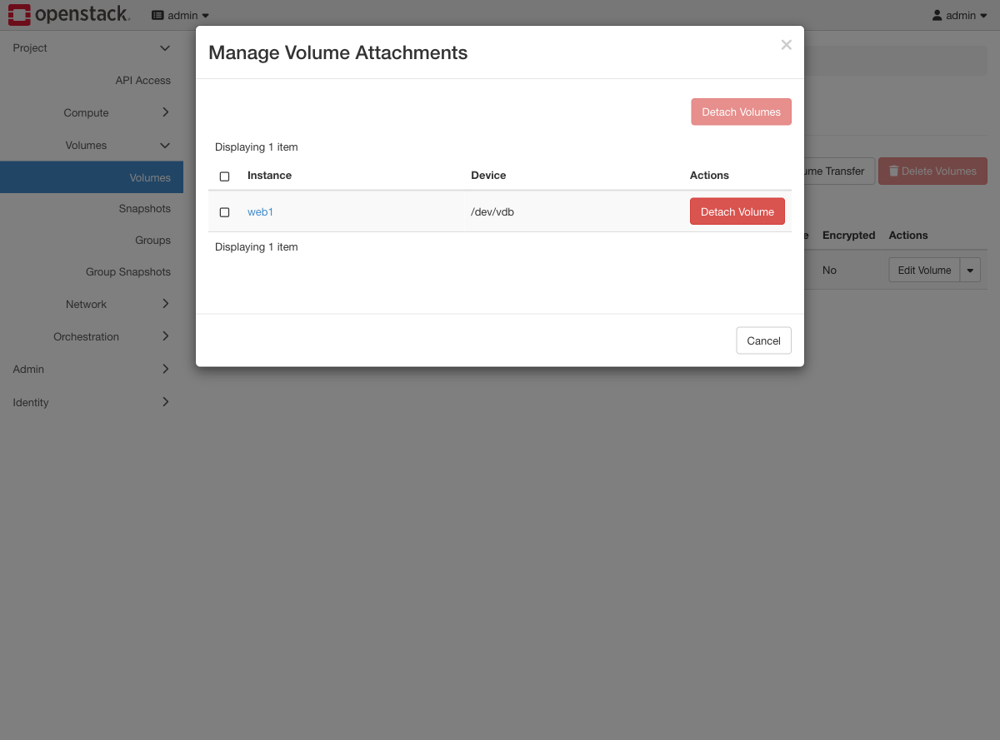
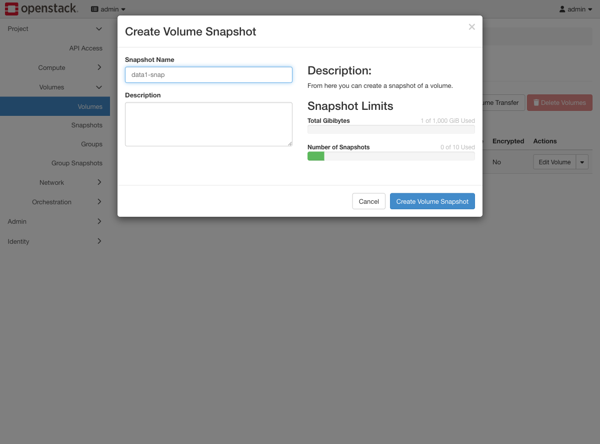
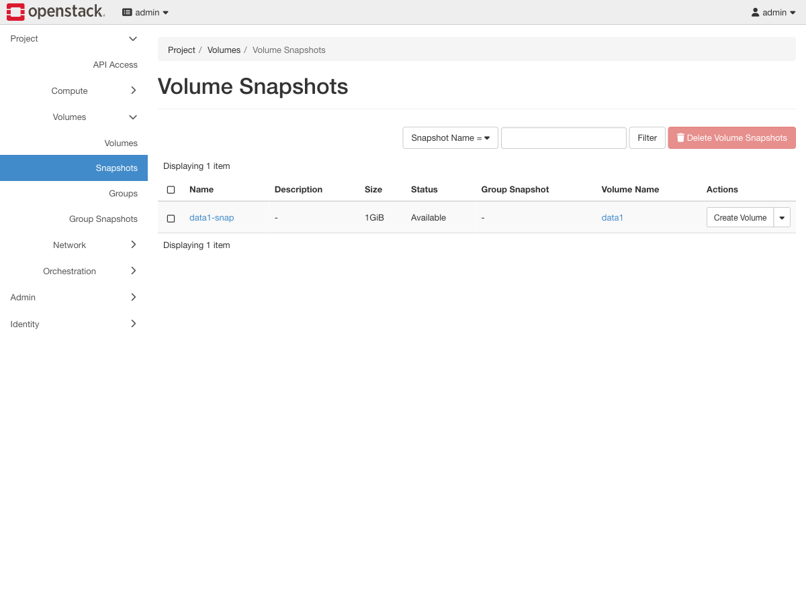
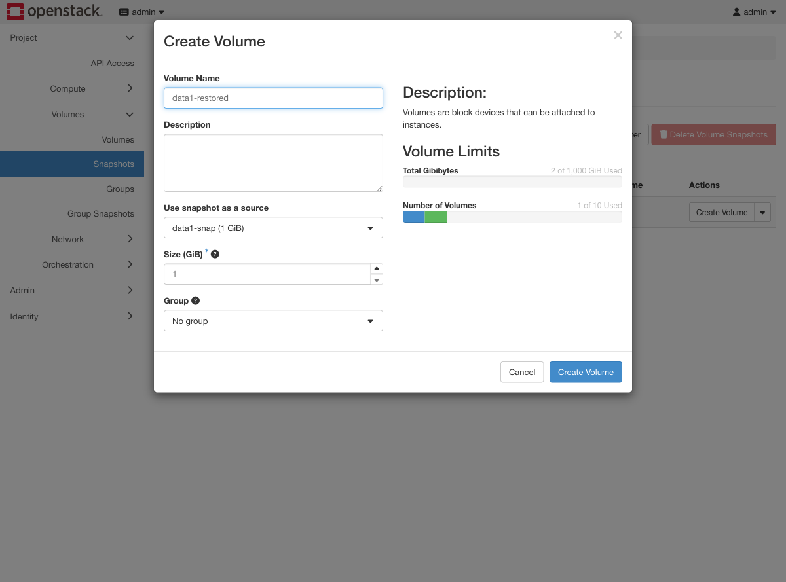
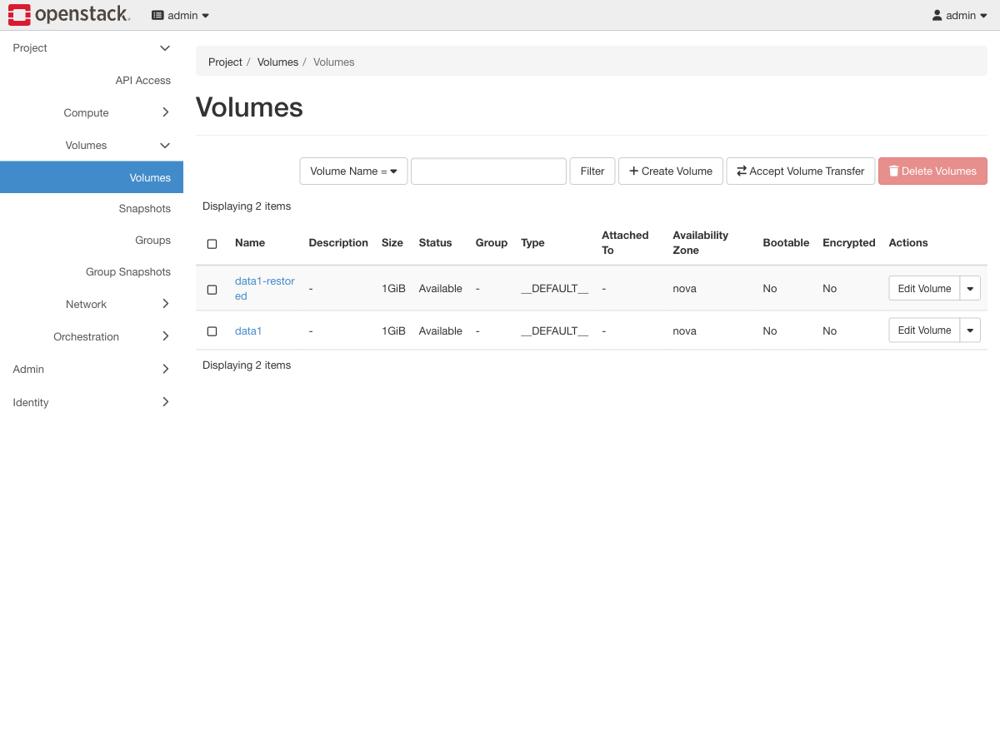

# Exercise 5 — Snapshot and restore (web UI)

Guide section: [Exercise 5](../openstack-ceph-lab-exercise.md#exercise-5--snapshot-and-restore)

Someone deletes production data at 16:40 on a Friday. There is no backup job, but
there is a snapshot from this morning. This is the recovery, and it takes about ten
seconds.

## Step 1 — Detach first

A volume must be detached before Cinder will snapshot it. **Manage Attachments** →
tick the row → **Detach Volume**.

## Step 2 — Take the snapshot

Volume dropdown → **Create Snapshot**.

The Snapshot Limits panel is honest about the cost: on RBD a snapshot is
copy-on-write, so it consumes no space until the original diverges. That is why
"snapshot before you touch it" is a reasonable habit here.

## Step 3 — Snapshots panel

**Project → Volumes → Snapshots.**

## Step 4 — Restore into a *new* volume

The snapshot's **Create Volume** action. Give it a new name.

Restoring into a new volume rather than over the original is the point. The damaged
volume stays exactly as it is while you work out what happened, and you can compare
the two.

## Step 5 — Both volumes

Attach `data1-restored`, mount it in the guest, and the file deleted from `data1` is
there. Measured on this lab: snapshot 3s, restore-to-new-volume 3s, attach 6s.
