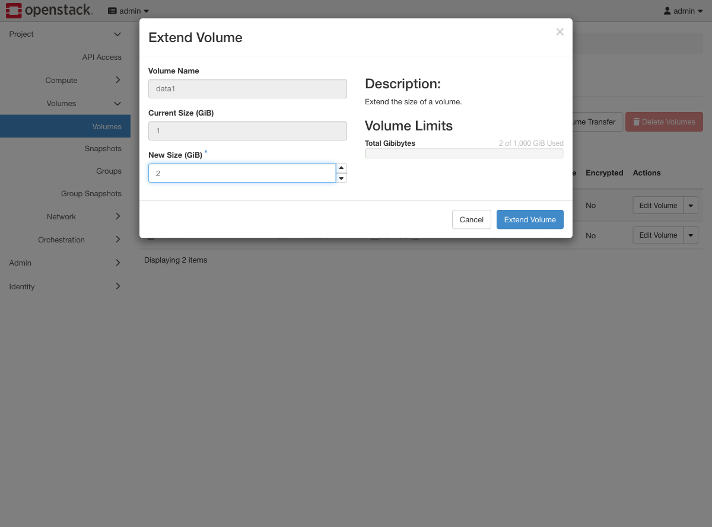
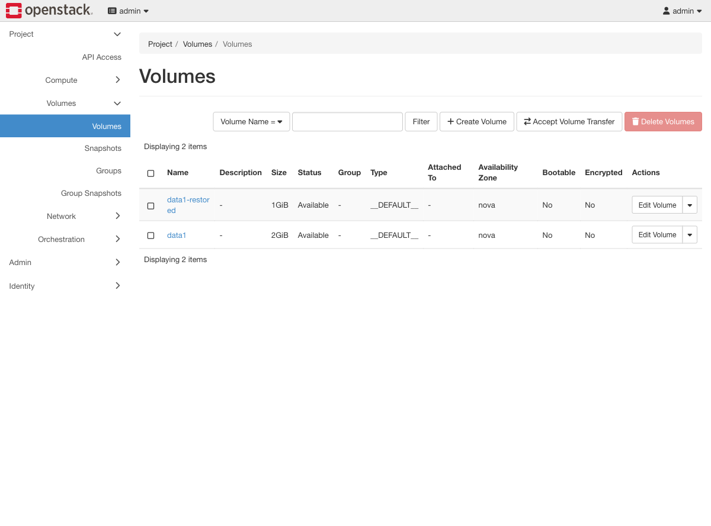

# Exercise 6 — Grow a volume that is already in use (web UI)

Guide section: [Exercise 6](../openstack-ceph-lab-exercise.md#exercise-6--grow-a-volume-that-is-already-in-use)

Monitoring pages you at 95%. The application cannot be stopped and there is no
maintenance window.

## Step 1 — Extend

Volume dropdown → **Extend Volume**. Detach it first; this deployment does not extend
attached volumes.



## Step 2 — The volume is bigger



## Step 3 — The filesystem is not

This is where the ticket actually comes from, and there is no UI for it. Re-attach,
then inside the guest:

```console
$ df -h /mnt/d
/dev/vdb              973.4M    280.0K    905.9M   0% /mnt/d      <- still 1 GiB

$ sudo resize2fs /dev/vdb

$ df -h /mnt/d
/dev/vdb                1.9G    280.0K      1.8G   0% /mnt/d      <- now 2 GiB
```

Horizon showing 2 GiB and the guest showing 1 GiB at the same time is not a bug — the
block device grew, the filesystem on it did not. Use `resize2fs` for ext4,
`xfs_growfs` for xfs, `resize.f2fs` for f2fs. "I extended the volume and nothing
changed" is always this.
