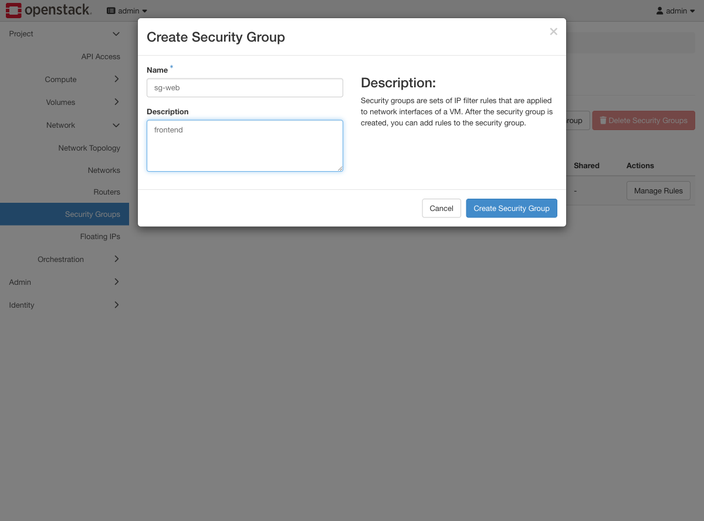
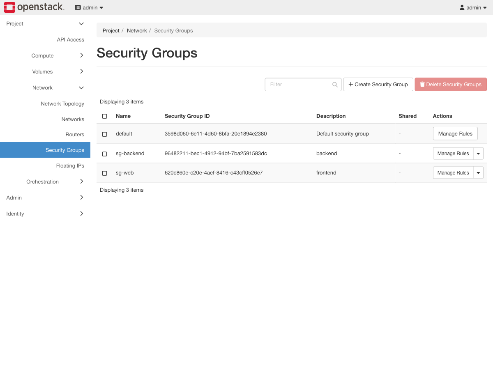
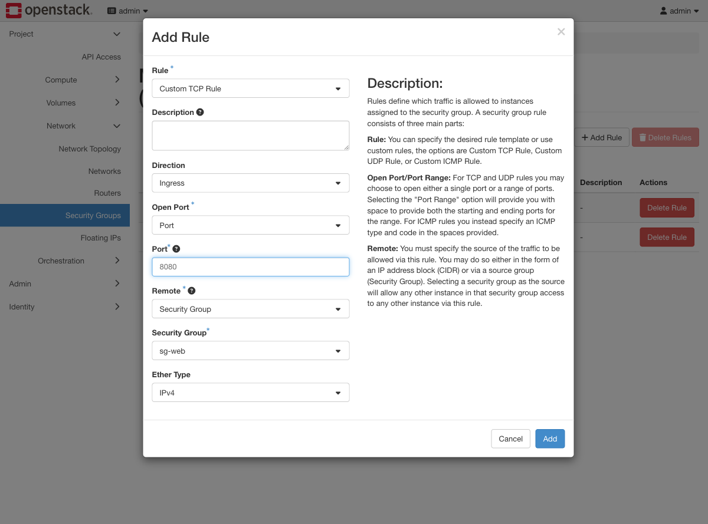
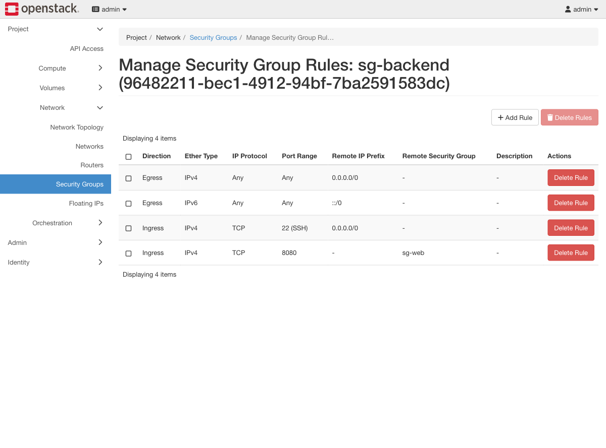
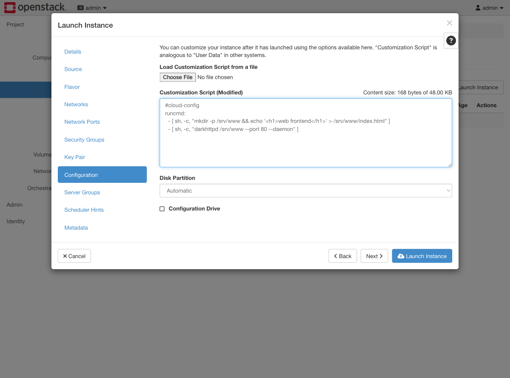
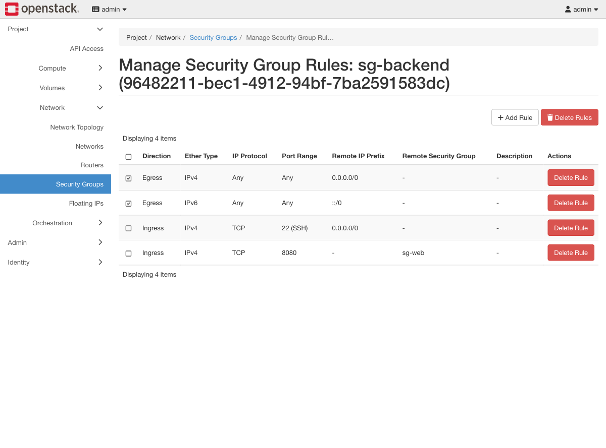
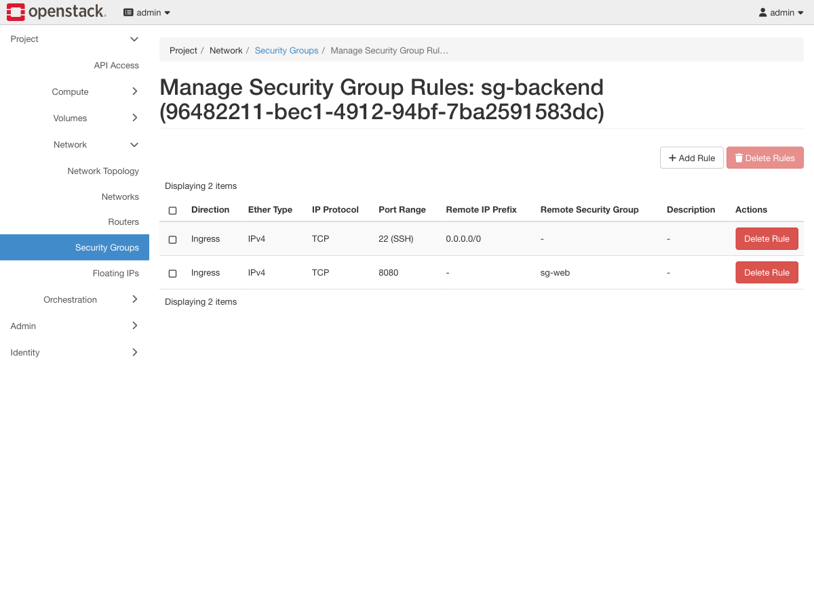

# Exercise 7 — Network isolation between a frontend and a backend (web UI)

Guide section: [Exercise 7](../openstack-ceph-lab-exercise.md#exercise-7--network-isolation-between-a-frontend-and-a-backend)

A security review asks: if the web tier is compromised, what can it reach? You need to
show the answer, not assert it.

## Step 1 — Two groups

**Project → Network → Security Groups → Create Security Group.**





## Step 2 — The rule that matters

`sg-backend` → **Manage Rules** → **Add Rule**. Set **Remote** to **Security Group**
and pick `sg-web`.



This is the whole exercise in one field. The rule says "port 8080, from members of
`sg-web`" — not from an IP range. Instances can come and go, get new addresses, be
rebuilt, and the rule keeps meaning the same thing.



Note the two egress rules Neutron adds by default: **Any / Any / 0.0.0.0/0** and the
IPv6 equivalent. Every new security group allows all outbound traffic.

## Step 3 — Boot one of each

Launch Instance → **Security Groups** tab: remove `default`, add the group you want.
Then the **Configuration** tab, which is where cloud-init user data goes.



Horizon calls it "Customization Script"; it is byte-for-byte the `--user-data` file
from the CLI, and the same `#cloud-config` rules apply.

## Step 4 — Take away egress

Tick both Egress rows and **Delete Rules**.





## What this proves

With `sg-backend` holding zero egress rules:

```console
# from backend, reaching out to web:80
$ wget -qO- --timeout 8 http://10.0.0.199:80/
wget: download timed out

# from web, reaching in to backend:8080 -- unchanged
$ wget -qO- --timeout 8 http://10.0.0.178:8080/
backend-api-v1
```

`backend` can no longer initiate a connection to anything, yet it still serves `web`
perfectly. Security groups are stateful: replies on an allowed inbound connection are
always permitted. That is exactly what you want from a compromised-backend scenario —
you stop it calling out without stopping it doing its job.

Note what is *not* the control here. `web` serves port 80 to the world, so no ingress
rule on `sg-web` would have stopped the backend reaching it. Egress is the control.
