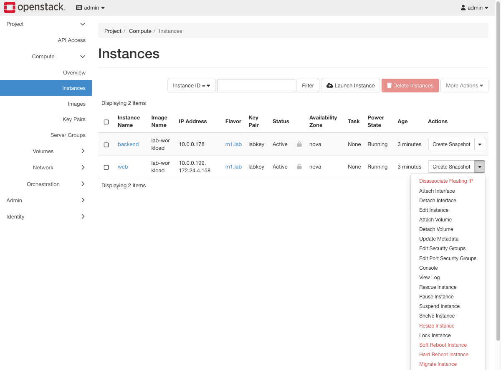
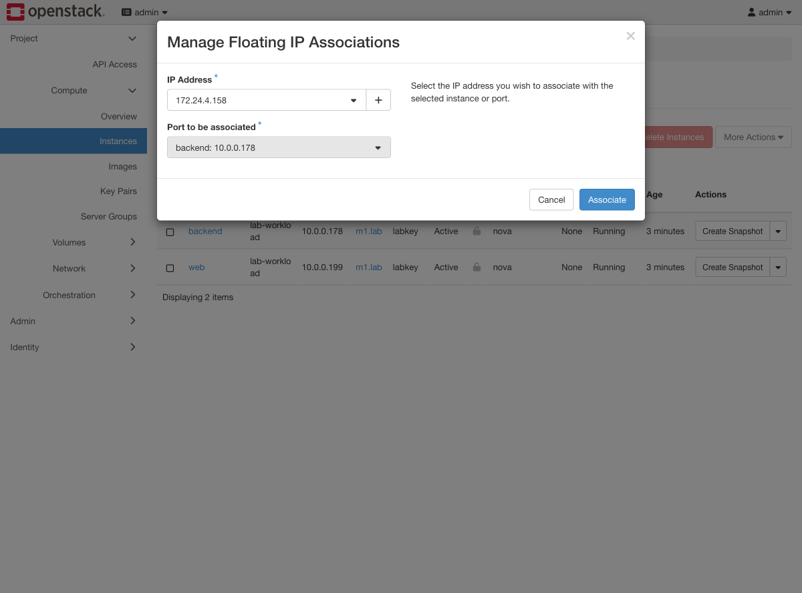
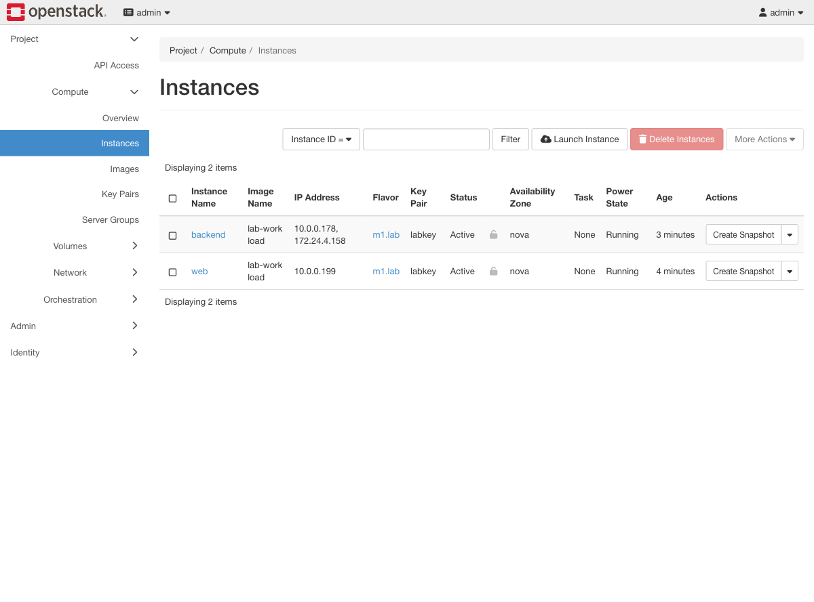

# Exercise 8 — Move a service between hosts with a floating IP (web UI)

Guide section: [Exercise 8](../openstack-ceph-lab-exercise.md#exercise-8--move-a-service-between-hosts-with-a-floating-ip)

A host needs urgent maintenance and the service has to keep answering on the address
DNS already knows. There is no load balancer. There is a floating IP, which is NAT you
control.

## Step 1 — Take it off the current instance

**Project → Compute → Instances** → the instance's dropdown → **Disassociate Floating
IP**.



The same menu entry reads "Associate" or "Disassociate" depending on whether the
instance already has one, which is a quick way to see the current state.

## Step 2 — Put it on the other one

The target instance's dropdown → **Associate Floating IP** → pick the same address.



## Step 3 — Same address, different machine



```console
$ ssh -i /etc/openstack-lab/labkey.pem alpine@172.24.4.158 hostname
backend
```

No reboot, no reconfiguration of either instance, about ten seconds. This is the crude
version of what Octavia would do, and it is genuinely how small clouds handle failover
before they have LBaaS.

## Watch out for orphans

**Project → Network → Floating IPs** is also where leaks show up. A floating IP
released from a deleted instance stays allocated to the project and keeps consuming
quota. Any row whose **Mapped Fixed IP Address** column is `-` is costing you a quota
slot for nothing.
