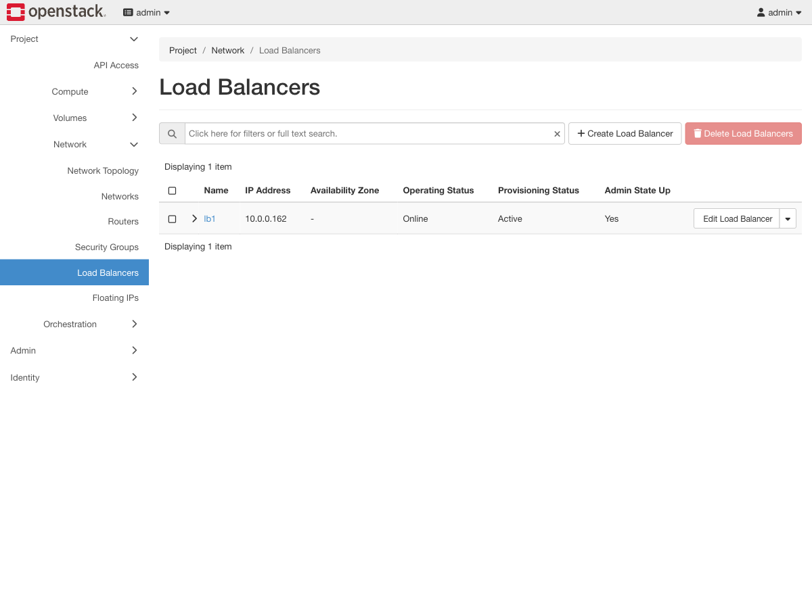
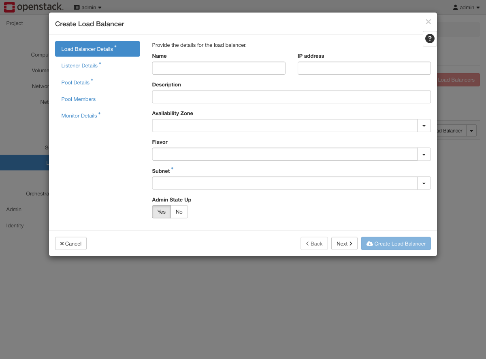
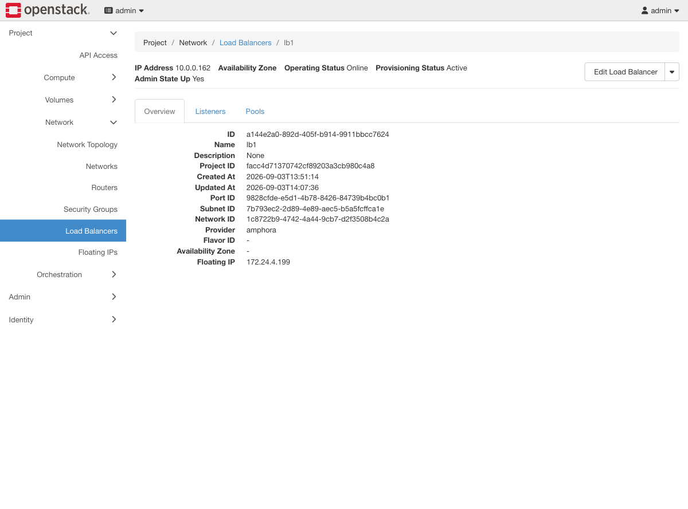
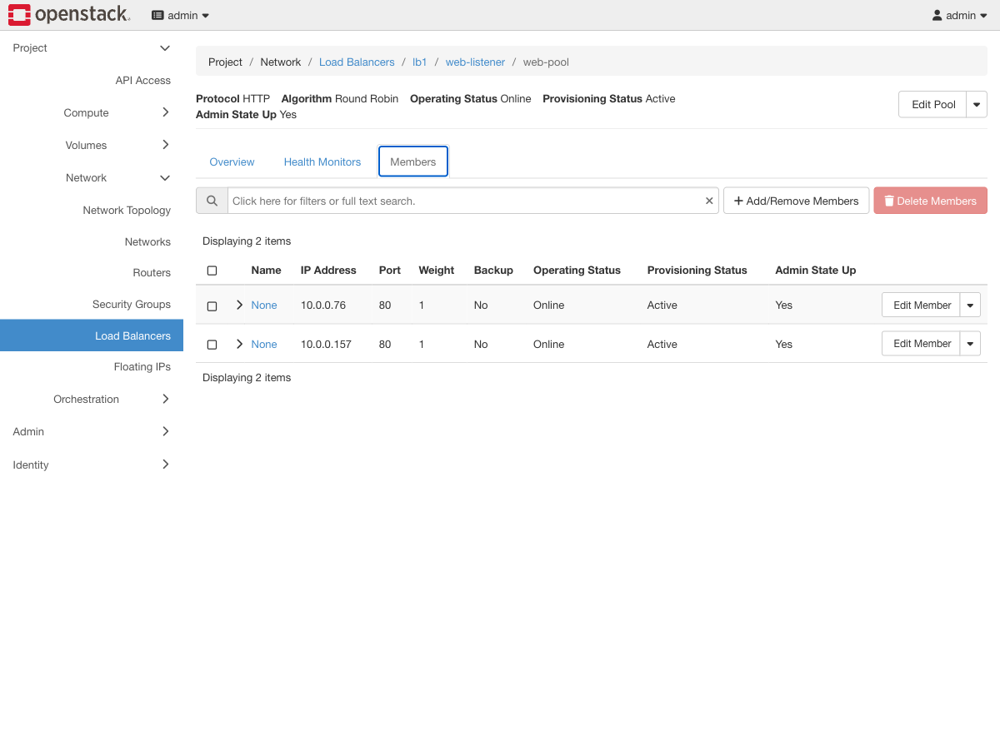

# Exercise 9 — One address, two servers (web UI)

Guide section: [Exercise 9](../openstack-ceph-lab-exercise.md#exercise-9--one-address-two-servers)

> **Needs the load-balancer build.**
> `ENABLE_NETWORK_LOADBALANCER=yes provision-lab --from 70-kolla`
> Without it there is no **Load Balancers** panel in Horizon at all.

Two web servers, one address users can type, and something that notices when one of
them dies. Exercise 8 did the first half by hand; this does both, and keeps doing it.

## Step 1 — The panel only exists with the build

**Project → Network → Load Balancers.**



If this entry is missing from the sidebar, `enable_horizon_octavia` is off and so is
the rest of the exercise.

Two status columns, and they answer different questions — Exercise 11 turns that into
the whole point:

- **Operating Status** — is it serving traffic right now
- **Provisioning Status** — is Octavia currently changing it

## Step 2 — Create Load Balancer is a five-step wizard



The left-hand nav is the entire object model in order: **Load Balancer Details →
Listener Details → Pool Details → Pool Members → Monitor Details.**

This is a real advantage over the CLI here. On the command line each of those is a
separate command that will not be accepted until the previous one has reached `ACTIVE`,
so you end up interleaving `openstack loadbalancer show` between them. The wizard
collects everything and builds it in one pass.

Pick `private-subnet` as the Subnet. The VIP lives on the tenant network; the floating
IP comes later.

## Step 3 — What got built

Click the load balancer name.



**Provider `amphora`** is the thing to notice. That is the driver that boots real
instances running HAProxy — two of them here, because the lab sets `ACTIVE_STANDBY`.
The alternative providers (`ovn`, for instance) do it in the network layer with no
instances at all, and are not available on this lab's ML2/OVS.

Creation takes a while for the same reason: **4 minutes 30 seconds** measured here,
nearly all of it booting amphorae.

The **Listeners** and **Pools** tabs are where everything else lives.

## Step 4 — Members, and the column that matters

Pools → `web-pool` → **Members**.



Both backends `Online`. This column is the health monitor's verdict, not a
configuration setting — and watching it change is the exercise.

Kill `darkhttpd` on one backend, wait about 25 seconds (`--delay 5 --max-retries 3` is
three consecutive failures), and refresh:

```
10.0.0.76   ERROR
```

Every request now goes to the survivor. Measured: 10 out of 10. Restart the service and
the monitor re-admits it on its own — back to 3 and 3.

**That control loop is the difference between a load balancer and a floating IP.** One
notices; the other waits for you to notice.

## Without the load-balancer build

The guide's Exercise 9 ends with an HAProxy-in-a-guest version that gives you
round-robin and sticky sessions for the price of one extra instance. It has no Horizon
panel — it is a config file in a VM — but it teaches the same two lessons.

What it cannot teach is [Exercise 11](ex11-lb-failover.md), because that HAProxy is a
single instance and dies with its guest. Which is rather the point.
