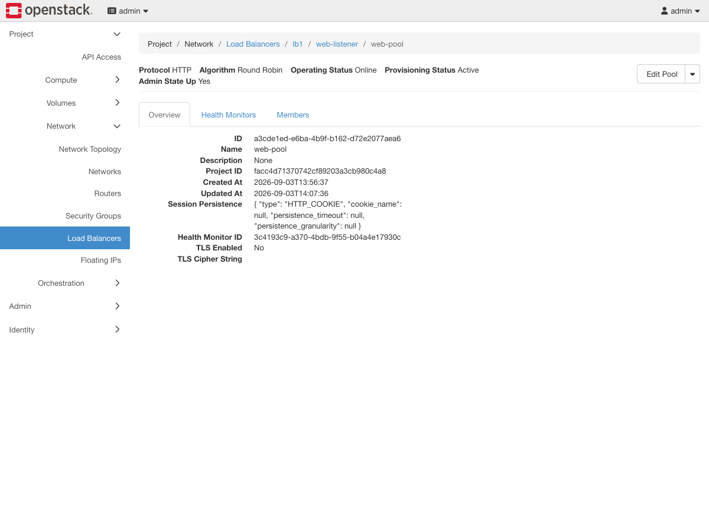

# Exercise 10 — The session that keeps logging out (web UI)

Guide section: [Exercise 10](../openstack-ceph-lab-exercise.md#exercise-10--the-session-that-keeps-logging-out)

> **Needs the load-balancer build.**

"Users get logged out at random, and it started when we added the second server." The
application keeps session state in memory; round-robin sends every other request to a
machine that has never heard of that session.

## Where the setting lives

**Load Balancers → `lb1` → Pools → `web-pool`.**



**Session Persistence** on the Overview tab, shown as the raw JSON Octavia stores:

```json
{ "type": "HTTP_COOKIE", "cookie_name": null,
  "persistence_timeout": null, "persistence_granularity": null }
```

**Edit Pool** exposes it as a dropdown with three values. Choosing the wrong one is why
this exercise exists.

## SOURCE_IP — and why the browser test lies

Set it, then reload the page in a second browser or a private window. **Nothing
changes.** You stay on the same backend.

That is not a broken demo, it is the property. Measured from one client: 8 requests, 8
to the same backend. The key is the source address, and every window on your machine
shares it.

Which means `SOURCE_IP` treats everyone behind one NAT, one office firewall or one
corporate proxy as a single client, and pins them all to one backend. Your carefully
balanced pair becomes one server with a spare.

## HTTP_COOKIE — the one your browser demo needs

| | Measured |
|---|---|
| One cookie jar, 6 requests (one browser session) | 6 → `server-web2` |
| Six fresh jars (six private windows) | 3 → `server-web1`, 3 → `server-web2` |

**This is the version to demonstrate in a browser.** Load the page, reload as often as
you like — you stay put. Open a private window and you may land on the other server.

## Look at the cookie in devtools

The load balancer inserts it, so it is visible to the client:

```
172.24.4.199  FALSE  /  FALSE  0  SRV  84075c31-93ae-4a79-9ff9-f3dc54596354
```

`SRV` holds the **member UUID**. Match it against the Members tab from
[Exercise 9](ex09-loadbalancer.md) and you know precisely which backend that browser is
pinned to — which turns sticky sessions from a diagram into something you can point at
mid-incident.

`APP_COOKIE` is the third option: same idea, keyed on a cookie the application already
sets, so the load balancer inserts nothing of its own.

**Cleanup.** Turn persistence off before Exercise 11, or requests will not visibly
alternate while you are trying to watch a failover.
