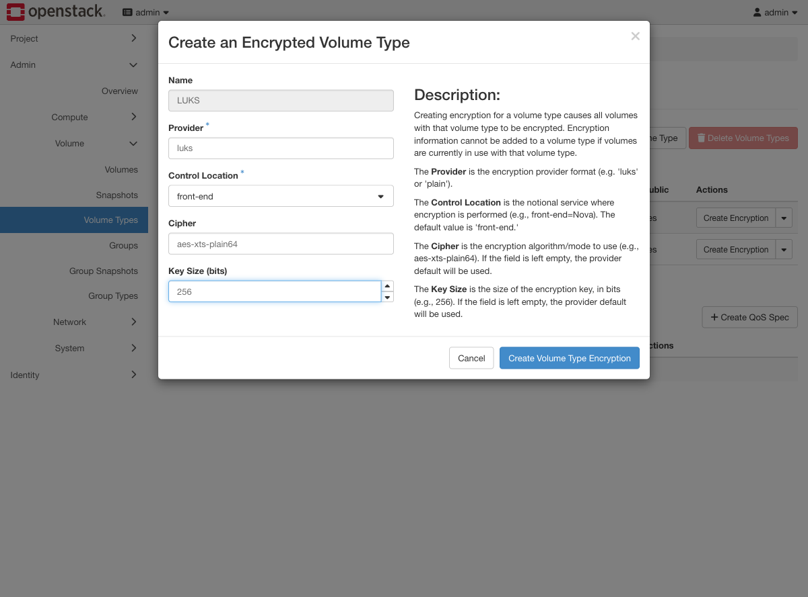
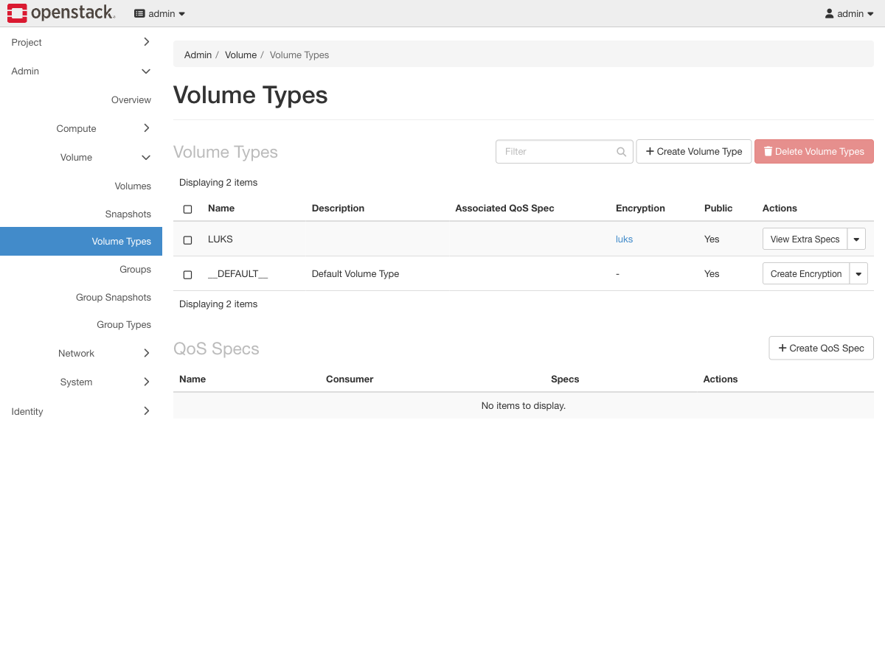
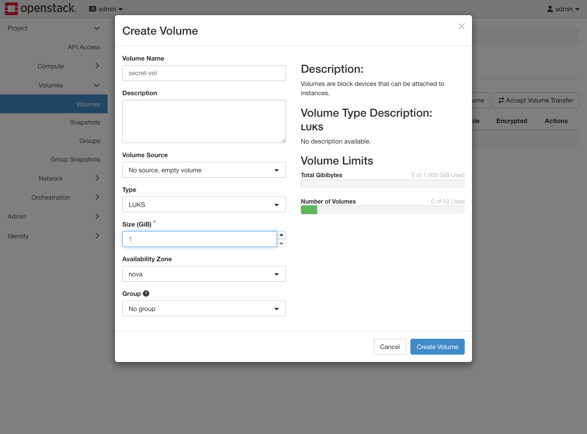
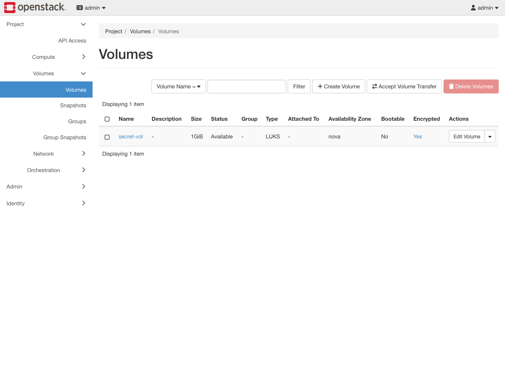

# Exercise 11 — Encryption at rest, with the key in Barbican (web UI)

Guide section: [Exercise 11](../openstack-ceph-lab-exercise.md#exercise-11--encryption-at-rest-with-the-key-in-barbican)

An auditor asks where the encryption keys live, and whether an operator with access to
the storage cluster could read customer data. "The disks are encrypted" is not an
answer until you can show it.

**Barbican has no Horizon panel in this deployment.** The secret store is CLI only
(`openstack secret store`). What Horizon does show is the volume type that uses it,
and that is the part you have to get right.

## Step 1 — Create the encryption on a volume type

**Admin → Volume → Volume Types.** Create an ordinary type first, then use the
**Create Encryption** link in its Encryption column.



**Control Location `front-end` is the setting that matters.** It puts the encryption on
the compute node, so plaintext never crosses the network to Ceph. `back-end` would rely
on the storage layer instead — which is exactly what the auditor is asking about.



The Encryption column now reads `luks`. A type cannot be given encryption while
volumes of that type are in use, so do this before anyone starts using it.

## Step 2 — A volume of that type

**Project → Volumes → Create Volume**, with **Type** set to `LUKS`.





The **Encrypted** column reads Yes. Attach it and inside the guest it is an ordinary
block device — `mkfs.ext4`, mount, write. That is the point: nothing in the guest knows
or cares.

## Step 3 — The proof

Now look at the same volume as an operator with full Ceph credentials would. Write a
canary in the guest, then from the VM:

```console
$ rbd -n client.cinder --keyring /etc/ceph/ceph.client.cinder.keyring \
    export cinder-volumes/volume-$VID - | strings | grep -c 'TOPSECRET-CANARY-STRING'
0

$ rbd -n client.cinder --keyring /etc/ceph/ceph.client.cinder.keyring \
    export cinder-volumes/volume-$VID - | head -c 2000 | strings | head -3
LUKS
xts-plain64
sha256
```

Zero. The string the guest just wrote and read back is not in the raw object; what is
there is the LUKS header. Run the same `grep` against an unencrypted volume and you
find it immediately — that contrast is the exercise.

Compare this with the Block → Images view from Exercise 4: the operator can still see
the image, its size and its usage. They just cannot read it.
