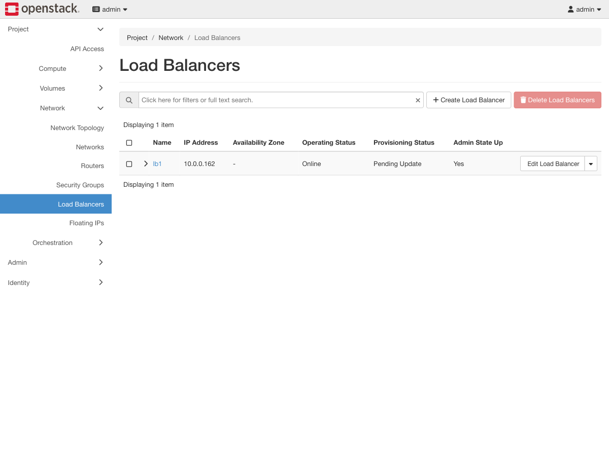

# Exercise 11 — The load balancer died (web UI)

Guide section: [Exercise 11](../openstack-ceph-lab-exercise.md#exercise-11--the-load-balancer-died)

> **Needs the load-balancer build, and `ACTIVE_STANDBY`.** With `SINGLE` topology
> there is one amphora and this exercise is a plain outage.

You put a load balancer in front of two servers so losing one would not matter. So what
happens when the load balancer dies? If the answer is "everything stops", you moved the
single point of failure rather than removed it.

## Horizon cannot show you the amphorae

This is the one exercise where the web UI is not enough, and knowing why is useful.

The amphorae are Nova instances in **Octavia's own service project**, not yours. They do
not appear under Project → Compute → Instances, and Horizon's load balancer panel has no
view of them. The only way to see the pair is the CLI:

```bash
OS loadbalancer amphora list -f value -c id -c role -c status -c lb_network_ip
```

```
6371c403…  MASTER  ALLOCATED  10.1.0.130
d822204b…  BACKUP  ALLOCATED  10.1.0.35
```

Two amphorae, one shared `ha_ip` — the VIP. VRRP between them decides who holds it.

**`compute_id` is not a column of `amphora list`.** It only appears in `amphora show`,
and looking for it in the list is the first thing that goes wrong:

```bash
AID=$(OS loadbalancer amphora list -f value -c id -c role | awk '$2=="MASTER"{print $1}')
CID=$(OS loadbalancer amphora show "$AID" -f value -c compute_id)
OS server delete "$CID"
```

## What Horizon does show, and it is the interesting part

Poll the VIP while you destroy the master, then watch the panel.



**Operating Status `Online`. Provisioning Status `Pending Update`.**

Those two columns from Exercise 9 have separated, and that is the whole exercise in one
row. The service never stopped. Octavia is rebuilding the pair underneath it.

## What the numbers actually were

| Run | Result |
|---|---|
| First | 1 failed request out of 90 (2-second polling) |
| Second | 0 failed — 12 consecutive polls, no gap at all |

So the honest figure is **at most one request, sometimes none** — not a constant. VRRP
sometimes completes the switch inside the two seconds between polls. To see the gap
reliably, poll faster than feels necessary.

## The lag worth internalising

Straight after the kill, the CLI still reported the destroyed amphora as
`ALLOCATED MASTER` and the load balancer as `ACTIVE` — while its instance was already
gone from `openstack server list`. Detection took about **45 seconds**.

**The data plane had failed over before the control plane knew anything was wrong.**
Traffic never depended on Octavia noticing; VRRP handled it, and Octavia's job was only
to rebuild afterwards.

A monitoring system watching `provisioning_status` would have reported a perfectly
healthy load balancer throughout a genuine hardware failure. Worth remembering next time
you choose what to alert on.

Once it does notice:

```
6371c403…  MASTER  PENDING_DELETE     <- the one you destroyed
d822204b…  BACKUP  ALLOCATED          <- now serving
de47ef65…  None    BOOTING            <- a replacement, unprompted
```

Nobody ran a command.

## What it costs

Two amphorae at 1 GB each, briefly three during a rebuild. Measured at the peak: **18.7
GB used of 26 GB, 6.8 GB still available**, with two 512 MB backends and three amphorae
alive at once. That is the most memory the lab ever uses.

That is the price of the answer to "what happens when the load balancer dies", and it is
why `octavia_loadbalancer_topology` is a setting rather than a default.

**Cleanup.** `OS loadbalancer delete lb1 --cascade`, then delete the two backends. Part G
wants the memory. Without `--cascade` the delete is refused while the listener, pool and
members exist — the same lesson as the Heat stack in [Exercise 15](ex15-heat.md).
