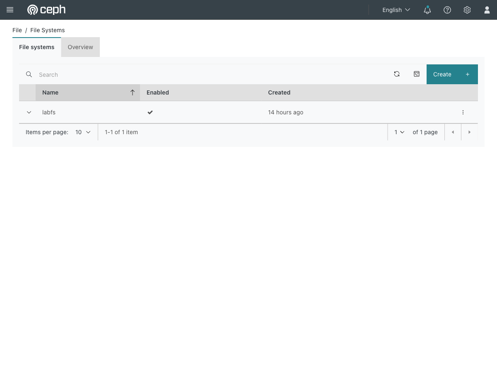
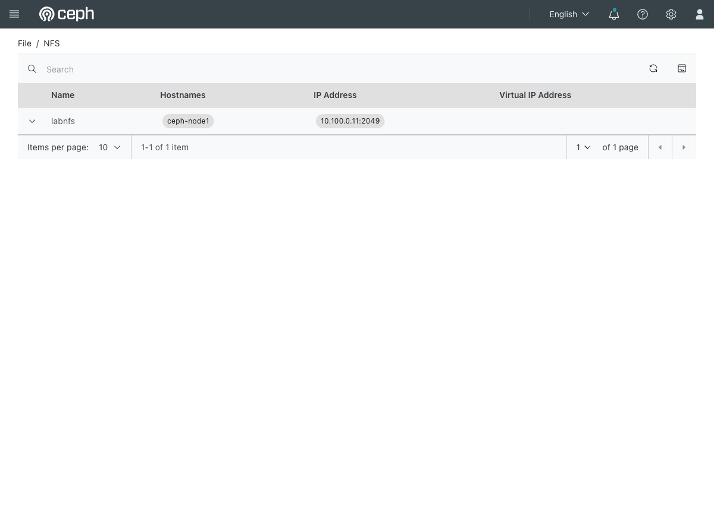

# Exercise 12 — Two workloads sharing one filesystem (web UI)

Guide section: [Exercise 12](../openstack-ceph-lab-exercise.md#exercise-12--two-workloads-sharing-one-filesystem)

Two web servers must serve the same content. Copying files to both is how content
drifts and one server starts serving yesterday's page.

**Horizon has nothing for this.** Manila is not deployed in this lab, so the share is
plain CephFS exported over NFS — below the OpenStack API. Everything visible is in the
Ceph dashboard, and the mount itself happens in the guest's cloud-init.

## Step 1 — The filesystem

**Ceph dashboard → File → File Systems.**



One filesystem, `labfs`. Expanding the row gives Details, Directories, Subvolumes,
Snapshots, Snapshot schedules and Clients — the Clients count tells you how many
things currently have it mounted, which is the fastest check that a guest's cloud-init
mount actually worked.

## Step 2 — The NFS export

**Ceph dashboard → File → NFS.**



The cluster is `labnfs`, running on `ceph-node1` at `10.100.0.11:2049`.

That address is on the Incus bridge and is not reachable from an instance. An Incus
proxy device republishes port 2049 on every VM interface, so guests mount it through
their default gateway instead:

```
mount -t nfs4 -o proto=tcp,port=2049,vers=4.1 172.24.4.1:/labshare /srv/shared
```

`172.24.4.1` is the VM's own address on `br-ex` — the guests' default gateway. If you
put `10.100.0.11` in the guest's cloud-init, the mount hangs and the instance boots
with an empty document root.

## Step 3 — Permissions

NFSv4 maps unknown users to `nobody` (uid 4294967294), so a guest writing into a
freshly created export gets "Permission denied" while your own writes from the VM
succeed. The dashboard will not show you this — the export looks fine. Fix it once
from the VM:

```bash
mount -t nfs4 -o proto=tcp,port=2049,vers=4.1 127.0.0.1:/labshare /mnt/labshare
chmod 777 /mnt/labshare
umount /mnt/labshare
```

In production you would align UIDs or configure idmapping instead.
