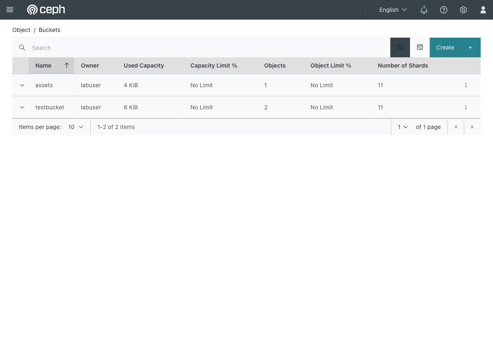

# Exercise 13 — Object storage for a workload (web UI)

Guide section: [Exercise 13](../openstack-ceph-lab-exercise.md#exercise-13--object-storage-for-a-workload)

An application needs somewhere for uploads, artefacts or static assets. On a volume
they are tied to one instance. Object storage is the answer, and the same Ceph cluster
already provides an S3 endpoint.

**Horizon has no object store panel here**, and that is not a bug. The RGW is not
registered as a Swift endpoint in Keystone, so its credentials come from
`radosgw-admin` rather than from your OpenStack login. Horizon has nothing to show.

## Step 1 — Buckets

**Ceph dashboard → Object → Buckets.**



Owner `labuser` is the `radosgw-admin` user the build created, not an OpenStack user.
The dashboard can create buckets, set quotas and browse objects from here.

## Step 2 — Reaching it from a workload

The point of the exercise is that a guest needs no S3 client and no credentials to
read a public object:

```console
$ wget -qO- http://172.24.4.1:8100/assets/asset.txt
served-from-ceph-object-storage
```

**Use path-style URLs.** `s3cmd` prints a "Public URL" in virtual-host form
(`http://assets.127.0.0.1:8100/asset.txt`) which needs wildcard DNS and will not
resolve here. `http://<host>:8100/<bucket>/<key>` always works.

For authenticated access from an instance, copy `/etc/openstack-lab/s3cfg` into it.
