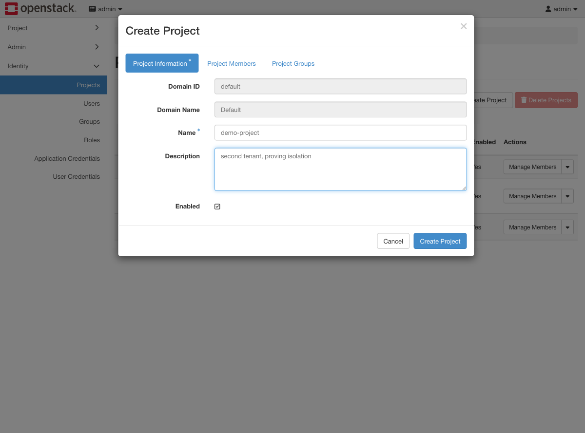
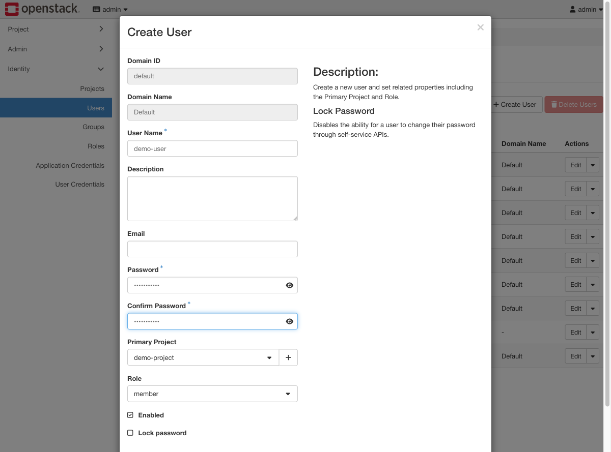
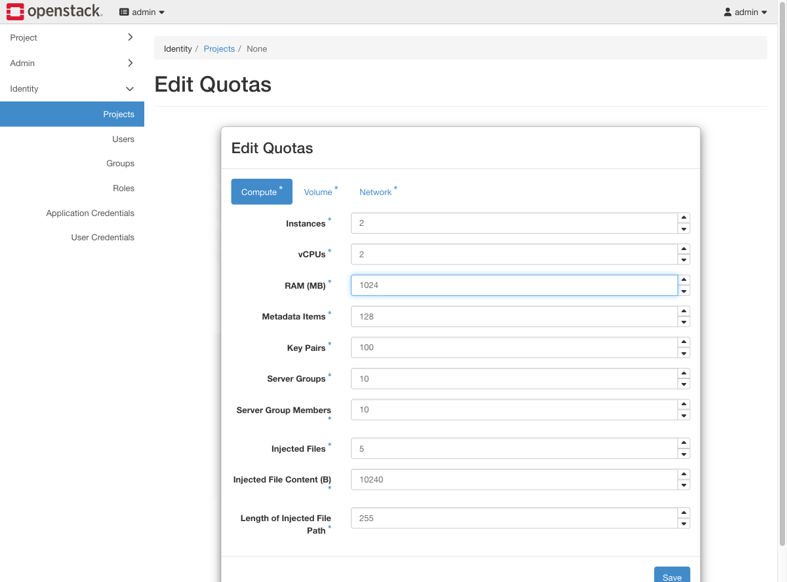
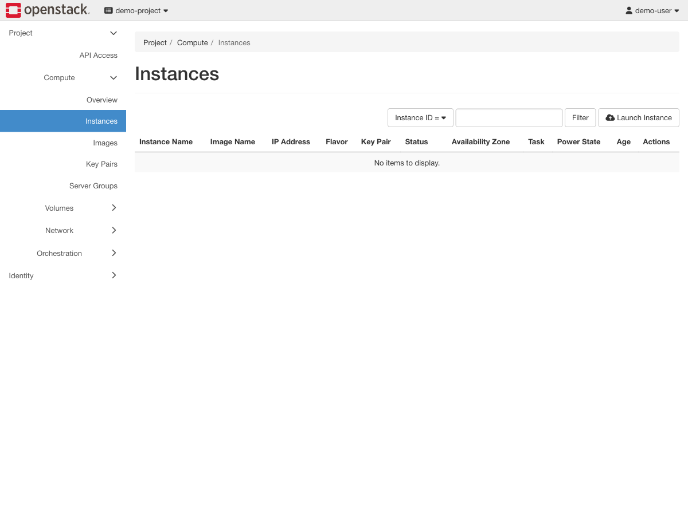

# Exercise 14 — A second tenant, and proving they cannot see each other (web UI)

Guide section: [Exercise 14](../openstack-ceph-lab-exercise.md#exercise-14--a-second-tenant-and-proving-they-cannot-see-each-other)

A new team wants onto your cloud. Before you say yes you need to demonstrate — not
assert — that they cannot see or touch the existing team's instances, and cannot
consume the whole cluster.

## Step 1 — The project

**Identity → Projects → Create Project.**

The Project Members and Project Groups tabs assign access at creation time. Leaving
them empty and creating the user separately, as below, is the same thing.

## Step 2 — The user

**Identity → Users → Create User.** Set **Primary Project** and **Role** in the same
form.

**The `member` role is deliberate.** It can create and manage its own resources but
cannot see other projects or change quotas. Give it `admin` instead and the isolation
below disappears — worth doing once to see the difference.

## Step 3 — Bound the blast radius

**Identity → Projects → demo-project → Modify Quotas.**

A new tenant with default quotas can consume the whole lab. Set this before handing
over the credentials, not after.

## Step 4 — The proof

Log out and back in as `demo-user`.

Two things to notice:

- The instance list is **empty**, though the admin project has three running on the
  same hypervisor, backed by the same Ceph cluster.
- The **Admin** menu is gone from the sidebar. Only Project and Identity remain. The
  `member` role cannot reach the panels you used in Exercises 1, 11 and 13.

**Images cross the boundary only if you let them.** `lab-workload` was created
`--public`, so this project can boot it. A private image would need
`openstack image add project` to be shared explicitly.
