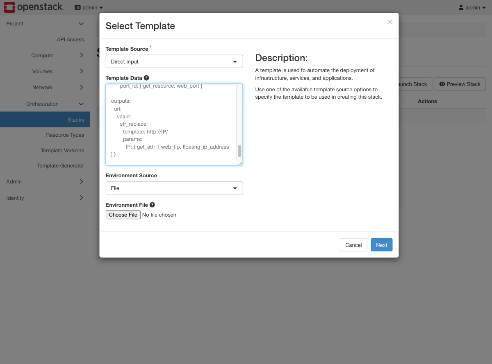
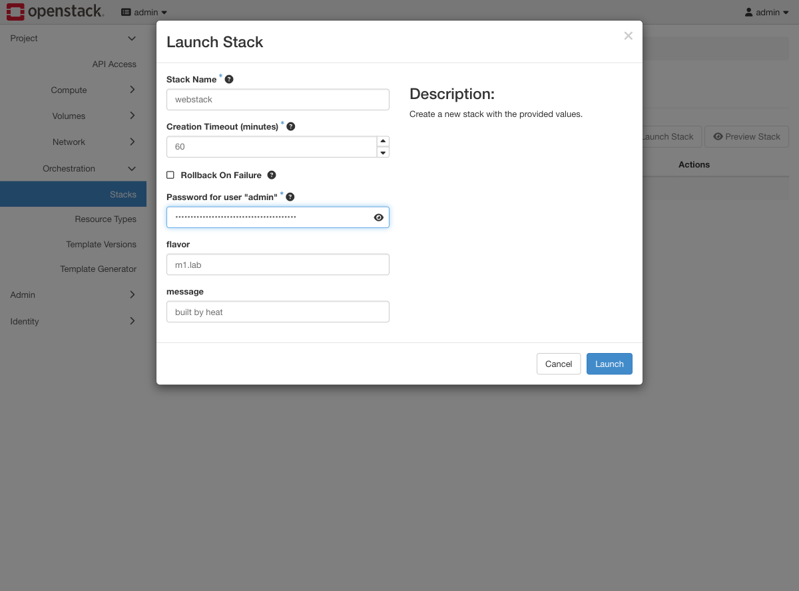
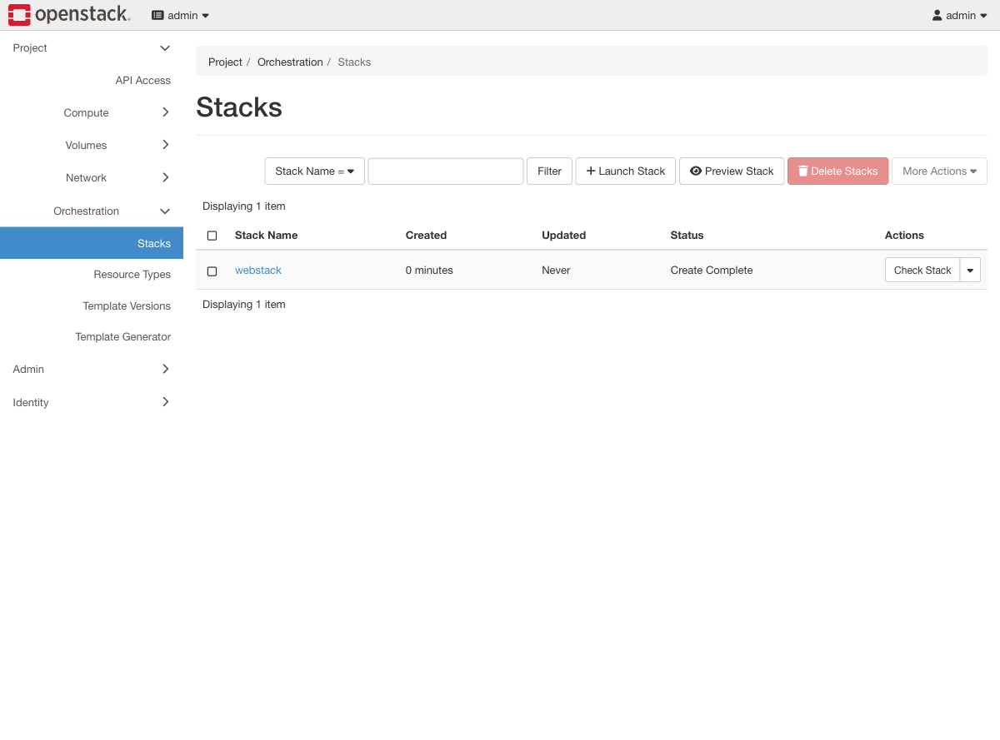
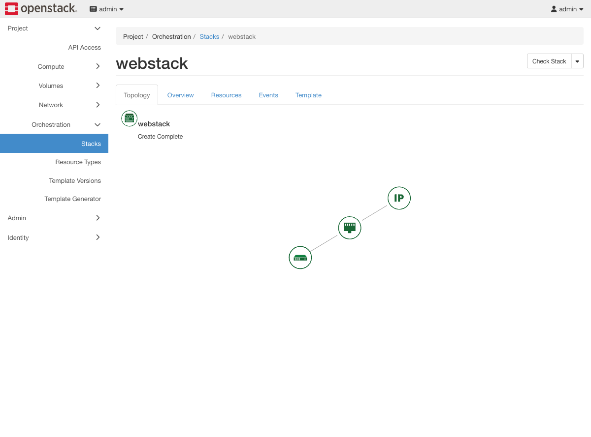
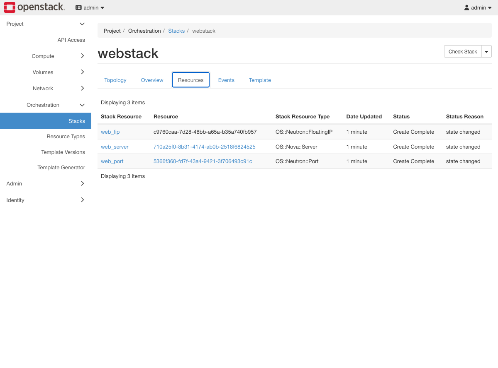

# Exercise 15 — Build the same thing declaratively with Heat (web UI)

Guide section: [Exercise 15](../openstack-ceph-lab-exercise.md#exercise-15--build-the-same-thing-declaratively-with-heat)

You built the web tier by hand in Exercise 7 and it worked. Now you need it in three
environments, reproducibly, and someone must be able to review the change before it
happens. Clicking through Horizon does not survive that — which is the joke of doing
it through Horizon here.

## Step 1 — The template

**Project → Orchestration → Stacks → Launch Stack.** Set **Template Source** to
**Direct Input** and paste the YAML.



File and URL are the other two options. In real use the template comes from a git
repository and this box is for a one-off.

## Step 2 — Parameters



Horizon reads the template's `parameters:` block and generates a form field for each
one, with the defaults filled in. **This is the answer to "where do I put
configuration?"** — the `message` parameter flows into cloud-init's user data via
`str_replace`, so the same template produces a different deployment per environment
without editing it. Parameters are your values file.

The password field is Heat asking for your own credentials so it can act on your
behalf later; it is not part of the template.

## Step 3 — Create Complete



About fifteen seconds for three resources.

## Step 4 — Topology

Click the stack name.



Server → port → floating IP, in dependency order. Heat worked out that ordering from
the `get_resource` references; nothing in the template stated it.

## Step 5 — Resources



Three resources tracked as one unit. The **Events** tab next to it is the audit trail —
what was created, in what order, and how long each took. The **Template** tab shows the
template as stored, which is what you compare against git when someone asks what is
actually deployed.

## Step 6 — The output

```console
$ openstack stack output show webstack url -f value -c output_value
http://172.24.4.80/

$ wget -qO- http://172.24.4.80/
<h1>built by heat</h1>
```

Outputs are what other systems consume. And `stack delete` removes all three resources
— no orphaned ports, no orphaned floating IPs. That is the other half of why templates
beat runbooks.
