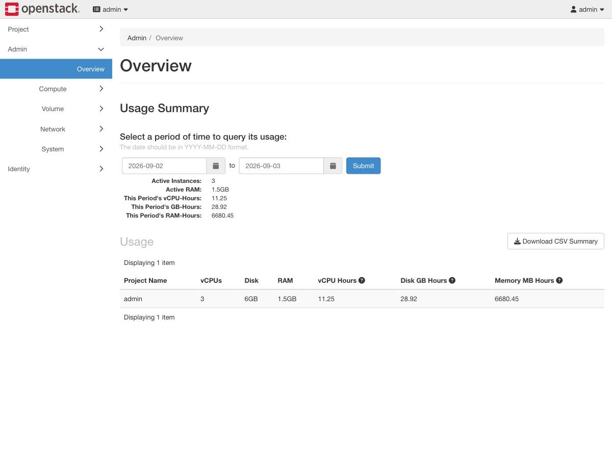
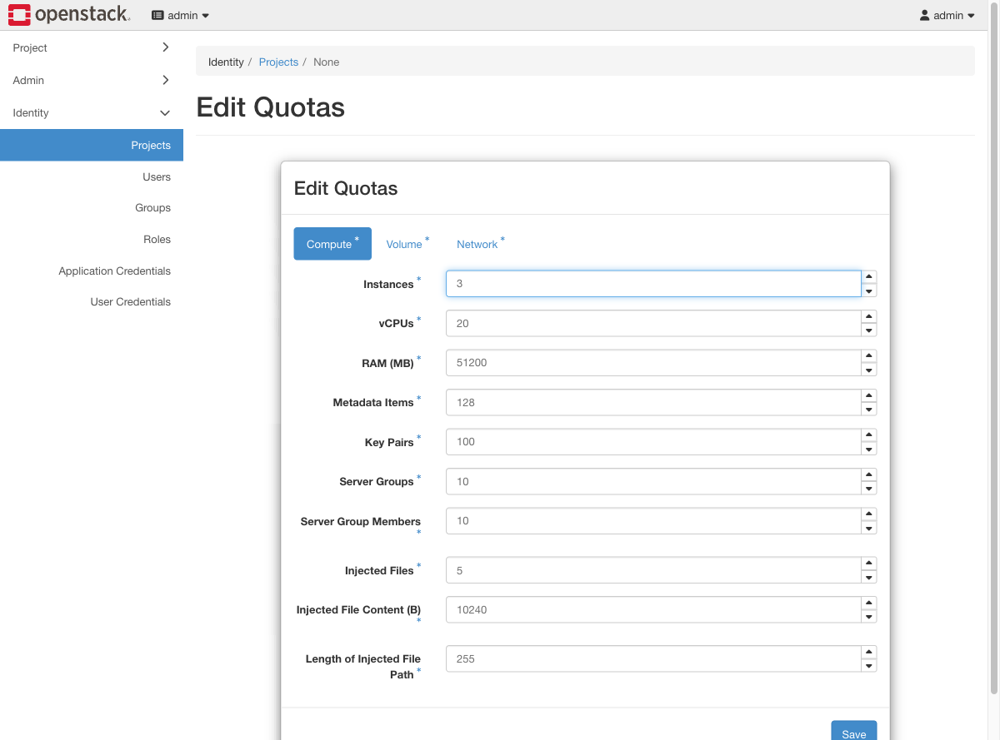
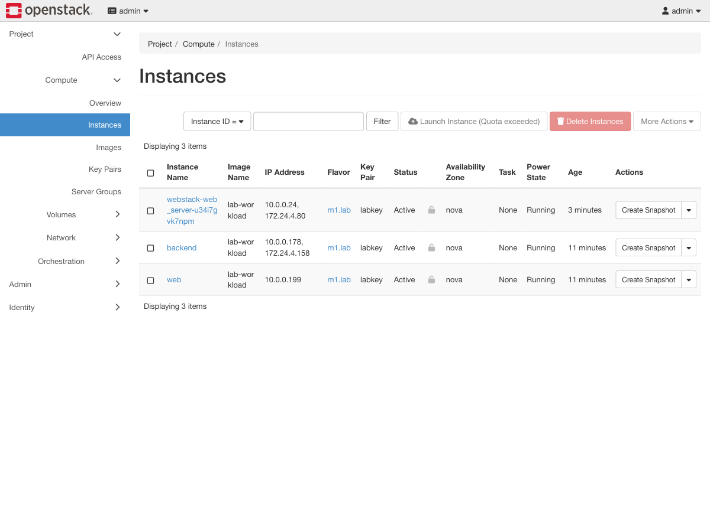
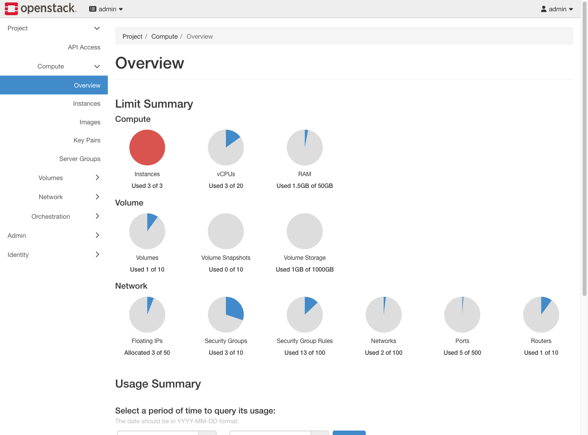

# Exercise 16 — Quotas, and the ticket that starts "I can't launch anything" (web UI)

Guide section: [Exercise 16](../openstack-ceph-lab-exercise.md#exercise-16--quotas-and-the-ticket-that-starts-i-cant-launch-anything)

A team's pipeline has stopped, every `server create` fails, and nothing in the logs
looks broken. Nine times out of ten they have hit a quota.

## Step 1 — What are they actually using?

**Admin → Overview.**



Per-project consumption with a date range, and a CSV download. This is the number to
quote back in the ticket.

## Step 2 — Where quotas are edited

**Identity → Projects** → the project's dropdown → **Modify Quotas**. Three tabs:
Compute, Volume, Network.



Reproduce the failure deliberately: set **Instances** to exactly the number currently
running.

## Step 3 — What the user sees



Horizon greys out **Launch Instance** and its tooltip reads "Launch Instance (Quota
exceeded)". The CLI is blunter and more useful:

```
ForbiddenException: 403: Quota exceeded for instances:
Requested 1, but already used 3 of 3 instances
```

That message names the resource, the request and the current usage — everything needed
to answer the ticket. If the user only reports "the button is greyed out", ask them to
run the CLI command.

## Step 4 — Where the user can see it themselves

**Project → Compute → Overview.**



The Instances donut is full and red. Point users at this page — it saves a ticket.

Quotas cover far more than instances: `cores`, `ram`, `volumes`, `gigabytes`,
`floating-ips`, `security-groups`. Floating IPs are the sneaky one, because they stay
allocated after the instance that used them is deleted.
