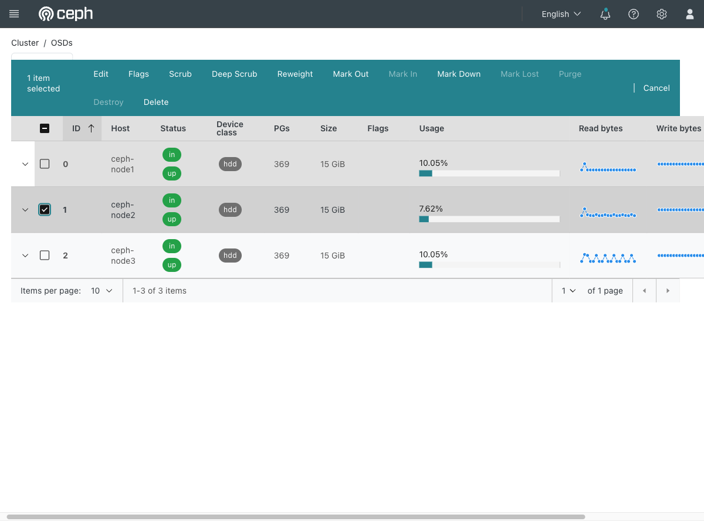

# Exercise 17 — Lose a disk while the service is running (web UI)

Guide section: [Exercise 17](../openstack-ceph-lab-exercise.md#exercise-17--lose-a-disk-while-the-service-is-running)

03:00, a disk fails, a third of your objects are degraded. The question at 09:00 is not
"what broke" but "was anything down?" — and you want to have already watched the
answer.

Keep a workload running and a page open on it before you start.

## Step 1 — The healthy baseline

**Ceph dashboard → Cluster → OSDs.**



Three OSDs, each `in` and `up`, each 15 GiB, each carrying 369 PGs and about 10% used.
Selecting a row reveals the whole action bar, which is the vocabulary for this exercise
and the next one:

- **Mark Out** — stop placing data on it; triggers a rebalance
- **Mark Down** — report it as unavailable
- **Purge** / **Destroy** — remove it from the cluster, greyed out here because they
  only apply to an OSD that is already out and down
- **Scrub** / **Deep Scrub** — Exercise 21
- **Reweight** — Exercise 18

## Step 2 — Kill one and watch

Stop the daemon from the CLI (`ceph orch daemon stop osd.1`) and keep this page and the
**Overview** open. Within about 35 seconds:

```
health: HEALTH_WARN
osd: 3 osds: 2 up (since 35s), 3 in
pgs: 646/1938 objects degraded (33.333%)
```

**Read that number.** With `size = 3`, losing one of three OSDs degrades exactly one
third of the replicas — 33.333% — and loses precisely nothing. Two copies of every
object are still online.

## Step 3 — Confirm nothing was down

The workload keeps serving and `rbd ls cinder-volumes` still lists. That is the whole
exercise: the cluster went `HEALTH_WARN` and the service did not notice.

Start the daemon again and the degraded count drains away. `HEALTH_OK` returned in
about 30 seconds here, because the OSD was only briefly absent and Ceph replayed the
difference rather than recopying everything.

Watching the degraded percentage fall in the dashboard is a far more legible version of
this than reading `ceph -s` in a loop.
