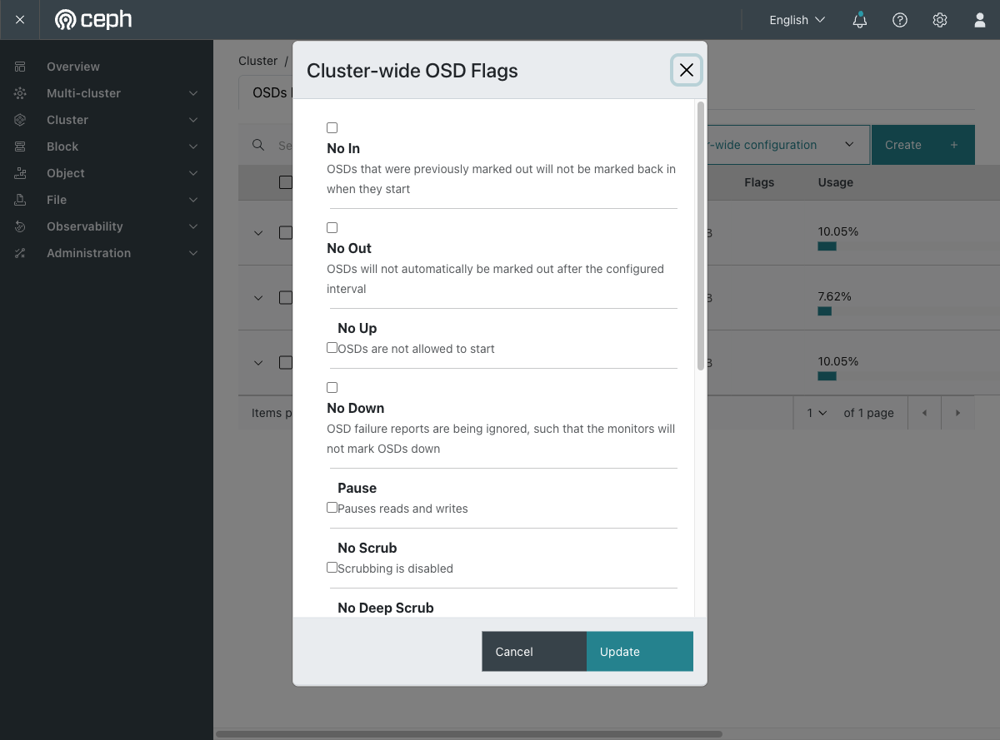

# Exercise 18 — Ceph maintenance mode (web UI)

Guide section: [Exercise 18](../openstack-ceph-lab-exercise.md#exercise-18--ceph-maintenance-mode)

You need to reboot a storage node. The moment the OSD goes down Ceph starts
re-replicating gigabytes to restore redundancy, and moves it all back five minutes
later when the node returns. That rebalance is pure waste.

## Step 1 — Host-level maintenance

**Ceph dashboard → Cluster → Hosts** → the host's ⋮ menu.

**Enter Maintenance** is the cephadm host operation: it stops the daemons on that host
and sets the flags for you. Use it when you are taking the whole machine away.

The other two entries matter for Exercise 26. **Start Drain** moves daemons off a host
you intend to remove; **Remove** takes it out of the cluster.

## Step 2 — The flags themselves

**Cluster → OSDs → Cluster-wide configuration → Flags.**

**No Out** is `noout` — "this OSD is coming back, don't reshuffle". Tick it, do the
work, untick it.

The dialog names the neighbours too, and each has a use: **No Backfill** and **No
Rebalance** stop data movement without stopping the OSDs, **No Scrub** / **No Deep
Scrub** buy quiet during a busy window, **Pause** stops reads and writes entirely.

## What to expect

Setting any flag puts the cluster into `HEALTH_WARN` with `flags noout`. That is
deliberate and useful — a forgotten flag then shows up on every status check.

**Leaving `noout` set is a real outage waiting to happen.** A genuinely dead disk will
never be replaced automatically, and you find out weeks later when a second one fails.
Confirm `HEALTH_OK` and no flags before you move on.
