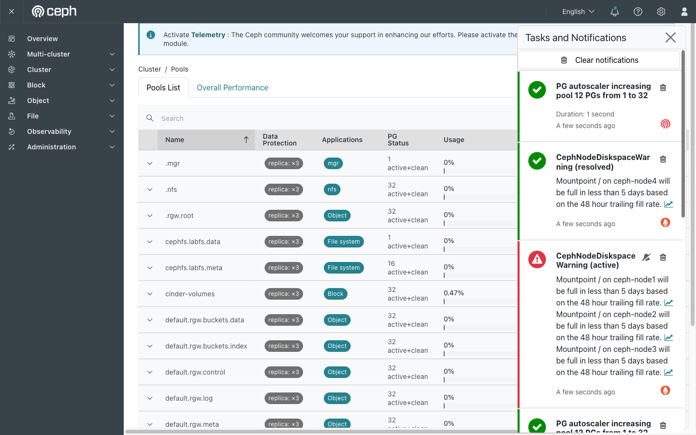
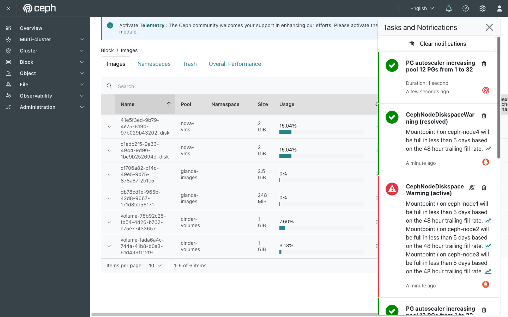

# Exercise 18 — RADOS underneath it all (web UI)

Guide section: [Exercise 18](../openstack-ceph-lab-exercise.md#exercise-18--rados-the-object-store-underneath-all-of-it)

Every volume, image, bucket and shared filesystem you have made so far is stored in one
object store. This exercise takes the lid off it. Most of the work is on the command
line — RADOS has no object browser — but two dashboard pages are worth seeing, and the
second one disagrees with the CLI in a way that is useful to understand.

## Step 1 — Pools, and who owns them

**Ceph dashboard → Cluster → Pools.** Set *Items per page* to 20; there are 14 and the
default view shows 10.

The `scratch` pool you created from the CLI appears here with the rest. Read the
**Applications** column across the whole table: `Block` is `cinder-volumes`, `File
system` is the two `cephfs.labfs.*` pools, `Object` is the RGW pools, `nfs` is the NFS
export, and your pool says `rados` because nothing but RADOS itself claims it.

That column is the answer to "which service owns this pool?" — the question you ask
first when a pool is filling up and you do not know who is writing to it.

**Data Protection** reads `replica: ×3` on every row. That is the multiplier behind
Exercise 25's arithmetic and Exercise 29's full cluster.

## Step 2 — Where the dashboard and the CLI disagree

**Block → Images.**

Find `volume-<id>` for `rados-demo`. The row says **1 GiB**, **256** objects, **4 MiB**
object size. On the CLI you counted 8 objects for the same volume.

Neither is wrong. 256 is the *provisioned* count — 1 GiB ÷ 4 MiB, the number of objects
that would exist if you filled it. 8 is what has actually been allocated, because RBD is
thin and only creates an object when something is written into it.

**This is worth remembering when you plan capacity.** The Objects column, and the Size
column beside it, describe what the image could grow into. `ceph df` and `rados ls` tell
you what it costs today. Size a cluster from the dashboard and you overestimate by the
entire thin-provisioning ratio.

The two `nova-vms` rows show the same thing for instance root disks: 2 GiB provisioned,
512 objects each, on a 248 MiB image.

## What has no web UI

There is no object browser. You cannot list, read or write RADOS objects from the
dashboard, and nothing in it shows you `rbd_data.<prefix>.*` names. `rados put`,
`rados get`, `rados stat` and `rbd export`/`import` are command line only.

That is not an omission. The dashboard is built around the *interfaces* — block, file,
object — and RADOS is the layer underneath all three. When those three disagree, or all
three break at once, the CLI is where you go.
