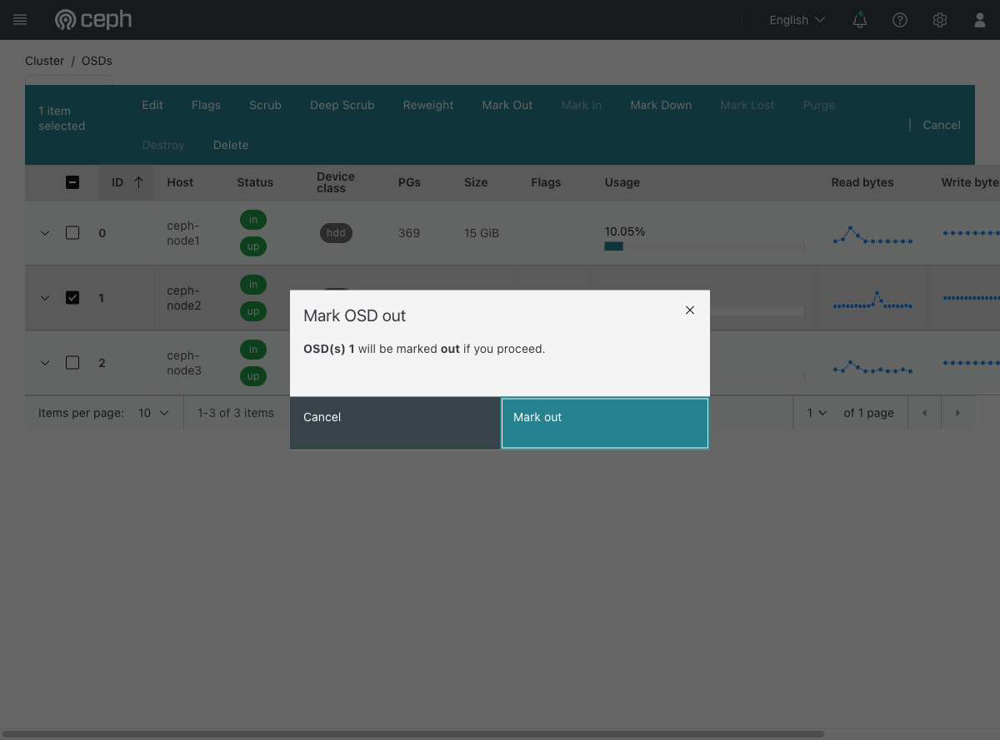

# Exercise 18 — Replace a failed disk properly (web UI)

Guide section: [Exercise 18](../openstack-ceph-lab-exercise.md#exercise-18--replace-a-failed-disk-properly)

The disk from Exercise 17 is not coming back. Replacing it is a sequence, and doing it
out of order is how you end up with a phantom OSD in the CRUSH map.

**The dialogs below were opened and cancelled, not confirmed.** The exercise itself
runs from the CLI so that each step's effect on `ceph -s` is visible; this shows where
the same actions live and, more usefully, which ones the dashboard refuses to let you
do out of order.

## Step 1 — Out first

**Cluster → OSDs** → select the OSD → **Mark Out**.



Marking out starts the rebalance: Ceph re-creates the third copy of everything that
lived on this OSD, elsewhere. Wait for that to finish before going further.

## Step 2 — The order the dashboard enforces

Look back at the action bar in
[Exercise 17](img/ex17-step01-ceph-osds-list.png): with the OSD still `in` and `up`,
**Destroy** and **Purge** are greyed out. They only become available once the OSD is
out and down.

That is the dashboard encoding the correct sequence:

1. **Mark Out** — drain the data
2. **Mark Down** — stop it being counted as available
3. **Destroy** — remove the OSD but keep its ID for the replacement disk, or
   **Purge** — remove it and its ID entirely

**Destroy versus Purge matters.** `destroy` keeps the OSD ID so a new disk can reuse
it, which keeps the CRUSH map tidy. `purge` removes everything. Reach for `destroy`
when a disk is being swapped, `purge` when a node is going away for good.

## Step 3 — What to check afterwards

A weight of 0 with the OSD still listed means the drain finished but the removal did
not:

```
1  hdd  0.01459  osd.1  up  0  1.00000     <- up, but weight 0
```

And after the host has no OSDs left, the host itself still holds a CRUSH bucket. The
leftovers this exercise is really about — a stranded monitor in the monmap, a host
entry with no OSDs — are visible on **Cluster → Hosts** and **Cluster → Monitors**,
and neither shows up as an error until something else goes wrong.
