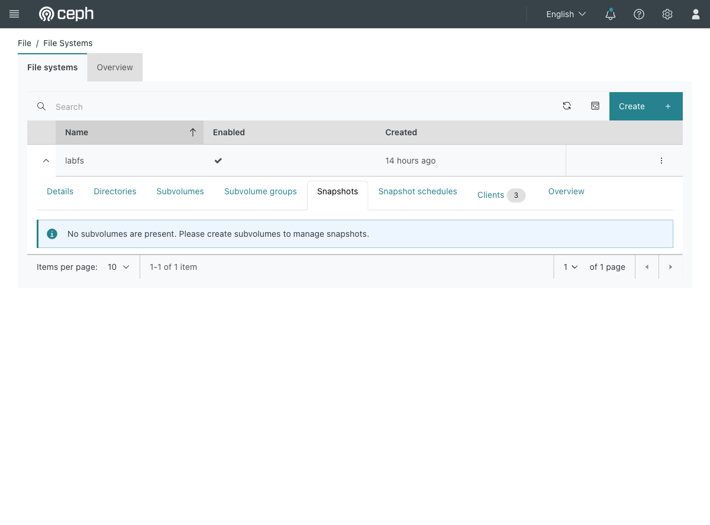

# Exercise 19 — Filesystem snapshots that cost nothing (web UI)

Guide section: [Exercise 19](../openstack-ceph-lab-exercise.md#exercise-19--filesystem-snapshots-that-cost-nothing)

Someone is about to run a migration script against the shared document root. You want
a restore point in one command, without detaching anything or stopping the web
servers.

## Step 1 — Where the dashboard puts snapshots

**File → File Systems** → expand `labfs` → **Snapshots**.



> No subvolumes are present. Please create subvolumes to manage snapshots.

That message is the point of this page. **The dashboard only manages snapshots of
subvolumes** — the CSI-style objects Manila and Kubernetes create. This lab's share is
a plain directory in the filesystem root, so the dashboard has nothing to offer.

The neighbouring tabs are still worth knowing: **Directories** browses the tree,
**Clients** shows who currently has it mounted, **Snapshot schedules** automates
retention once subvolumes exist.

## Step 2 — What actually works here

A CephFS snapshot is a directory. From a native CephFS mount on the VM — not from the
guests, and not over NFS:

```bash
mkdir /mnt/cephfs/.snap/before-migration       # this IS the snapshot
```

Cause the incident and recover:

```bash
rm -f /mnt/cephfs/index.html
ls /mnt/cephfs/                                # gone
ls /mnt/cephfs/.snap/before-migration/         # still there
cp /mnt/cephfs/.snap/before-migration/index.html /mnt/cephfs/
rmdir /mnt/cephfs/.snap/before-migration       # release it
```

`mkdir` to snapshot, `rmdir` to release. Copy-on-write, so an idle snapshot costs
nothing and only diverging data consumes space.

**The `.snap` directory is not visible over NFS.** Ganesha does not export it, so this
has to be done on a native CephFS mount. The VM's kernel has no CephFS driver either,
so use `ceph-fuse`.

Unlike Cinder snapshots (Exercise 5), nothing has to be detached and no workload is
interrupted.
