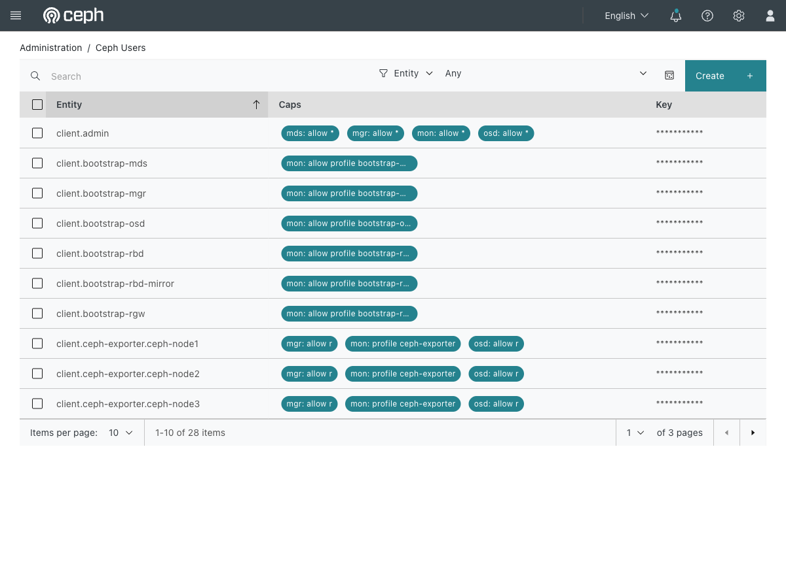

# Exercise 19 — Scoping credentials with a restricted Ceph user (web UI)

Guide section: [Exercise 19](../openstack-ceph-lab-exercise.md#exercise-19--scoping-credentials-with-a-restricted-ceph-user)

A monitoring tool wants Ceph credentials. It needs to read volumes; it has no business
writing to them. Handing it `client.admin` is the path of least resistance and exactly
how a compromised monitoring box turns into a destroyed cluster.

## Step 1 — Read the capabilities you already have

**Ceph dashboard → Administration → Ceph Users.**



Every CephX entity with its caps in one table. This is `ceph auth ls` made readable,
and it is the fastest way to answer "what can this credential actually do?".

Read the rows the lab already uses:

- `client.admin` — `mds: allow *`, `mgr: allow *`, `mon: allow *`, `osd: allow * *`.
  Unrestricted. This is what you are trying not to hand out.
- `client.glance` — can write to `glance-images` and nothing else.
- `client.cinder` — read-only on `glance-images` so Nova can clone images but cannot
  modify them, read-write on its own pools.

The bootstrap entities show the pattern in its simplest form: `mon: allow profile
bootstrap-osd` and nothing else at all.

## Step 2 — Create the restricted user

The dashboard's **Create** button on this page can build a new entity with caps. The
guide uses the CLI because the capability string is the thing worth reading:

```bash
ceph auth get-or-create client.readonly \
  mon 'profile rbd' \
  osd 'profile rbd-read-only pool=cinder-volumes'
```

Whichever way you create it, it appears in this table, and that is where you check it
later.

## Step 3 — The proof

```console
$ rbd $KR ls cinder-volumes
volume-...                                    <- works

$ rbd $KR create --size 10 cinder-volumes/should-fail
rbd: create error: (1) Operation not permitted
```

Reading works, writing is refused — not by the client, not by file permissions, but by
the capability attached to the credential.
