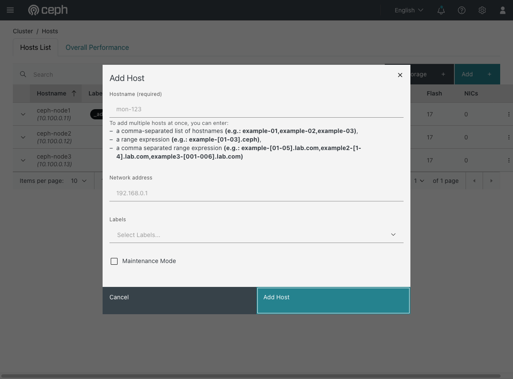

# Exercise 21 — Extend the cluster with another disk (web UI)

Guide section: [Exercise 27](../openstack-ceph-lab-exercise.md#exercise-21--extend-the-cluster-with-another-disk)

The cluster is filling up and you have budget for another storage node. Later, that
node is decommissioned. Both directions are routine, and both leave things behind if
you stop at the obvious step — which is the real lesson.

## Step 1 — Adding

**Cluster → Hosts → Add.**

Hostname, network address, labels, and a maintenance-mode toggle for adding a host you
are not ready to use yet. The hostname field takes ranges
(`example-[01-03].ceph`) for adding a rack at a time.

**Labels are the part worth using.** cephadm places daemons by label, so labelling a
host `osd` or `mon` at add time is what makes the service specs pick it up. The
`_admin` label — visible on `ceph-node1` in the hosts list — is what puts a copy of
the admin keyring on that host.

Adding the host does not add OSDs. The disks come next, via **Cluster → OSDs →
Create**, or automatically if a service spec matches.
