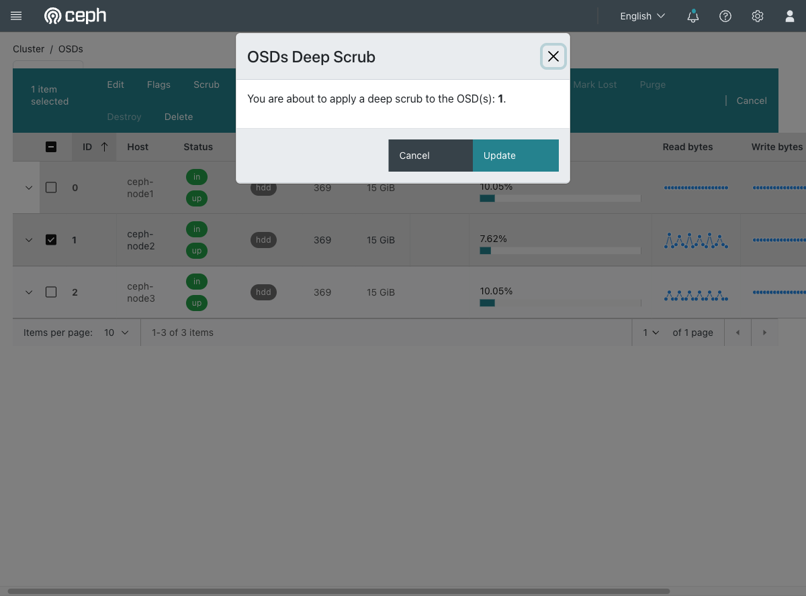
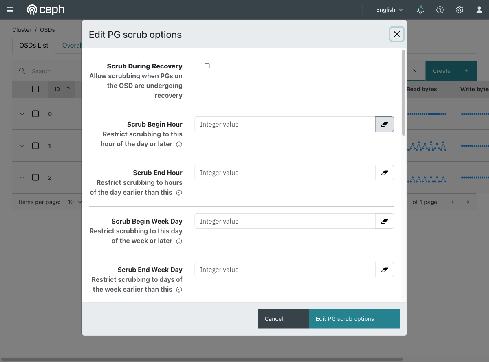

# Exercise 24 — Verify the data is really intact (web UI)

Guide section: [Exercise 24](../openstack-ceph-lab-exercise.md#exercise-24--verify-the-data-is-really-intact)

`HEALTH_OK` means every object is present and the right number of copies exist. It does
not mean the bytes are still correct. Scrubbing is what checks that.

## Step 1 — Trigger one on demand

**Cluster → OSDs** → select an OSD → **Deep Scrub**.

**Scrub** compares metadata and object sizes — cheap, runs daily by default. **Deep
Scrub** reads every object and compares checksums across replicas — expensive, weekly
by default, and the one that actually catches bit rot.

Confirming queues it; the dashboard reports "Deep scrub was initialized in the
following OSD(s): 1". It runs in the background, so nothing appears to happen
immediately. Watch **Observability → Logs** for the result.

Run one on demand after a power loss, or on a disk that has been throwing errors.

## Step 2 — The schedule

**Cluster → OSDs → Cluster-wide configuration → PG scrub.**

This is where the automatic behaviour is tuned, and the fields name the real
trade-offs:

- **Scrub During Recovery** — off by default; leave it off unless you enjoy slow
  recoveries
- **Scrub Begin Hour / End Hour**, **Begin Week Day / End Week Day** — confine
  scrubbing to a quiet window
- **Scrub Min / Max Interval** — how often a PG is eligible, and when it becomes
  overdue

If you ever see `pgs not deep-scrubbed in time` in a health warning, this dialog is
where the cause usually is: a window too narrow for the cluster to get through
everything.
