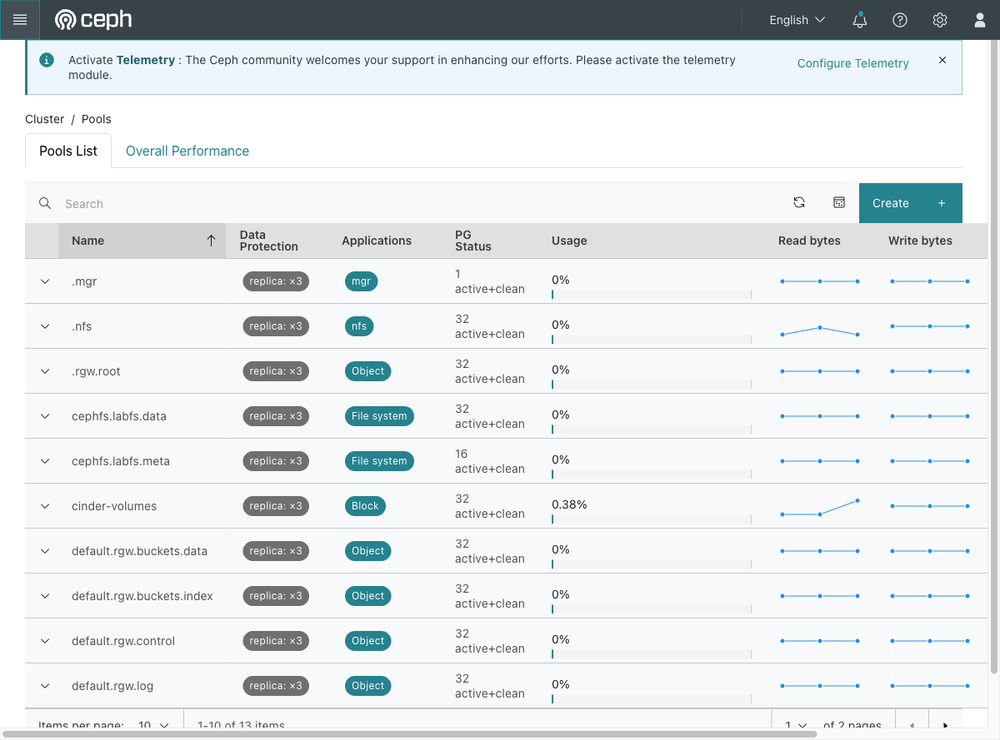

# Exercise 25 — What replication actually costs you (web UI)

Guide section: [Exercise 25](../openstack-ceph-lab-exercise.md#exercise-25--what-replication-actually-costs-you)

Someone asks for a 10 TB volume and you have 20 TB of disk. You have to explain why
the answer is no.

## Step 1 — Every pool, with its replication factor

**Ceph dashboard → Cluster → Pools.**



The **Data Protection** column reads `replica: ×3` on every pool — the Glance images,
the Cinder volumes, the Nova root disks, the CephFS metadata, the RGW indexes. That
single column is the answer to the capacity question.

Expanding a row gives the per-pool detail including MAX AVAIL, and the **Overall
Performance** tab has the Grafana panels for throughput per pool.

## Step 2 — The arithmetic

```
TOTAL           45 GiB   40 GiB avail
cinder-volumes  55 MiB stored   160 MiB used   MAX AVAIL 13 GiB
```

Three numbers matter:

- **stored** — your data
- **used** — what it occupies after replication, roughly 3×
- **MAX AVAIL** — what you can still write

On a 45 GiB cluster at `size = 3` you have about 13 GiB of usable space, not 45.

Drop `cinder-volumes` to `size 2` and the same data occupies 106 MiB instead of 160
MiB, with MAX AVAIL rising from 13 GiB to 19 GiB. **Put it back.** `size = 2` means one
disk failure leaves a single copy and no redundancy at all while it recovers.

## Why this matters two exercises later

An image is charged at `size × replication`. A 3.5 GB distro image costs 10.5 GB of a
45 GiB cluster — which is how Exercise 29's cluster fills up, and why this lab builds a
248 MB image instead.
