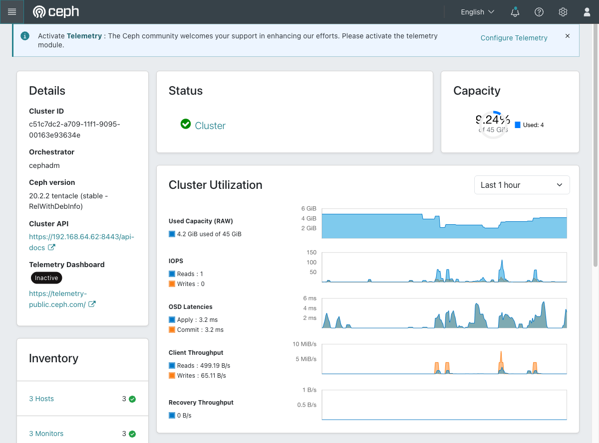
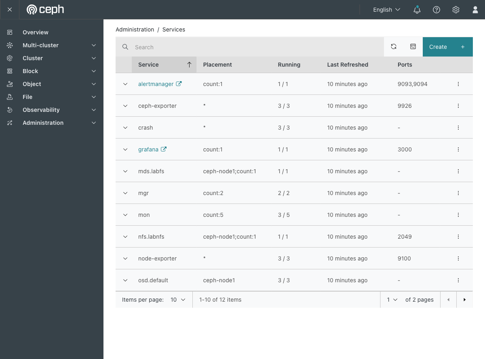
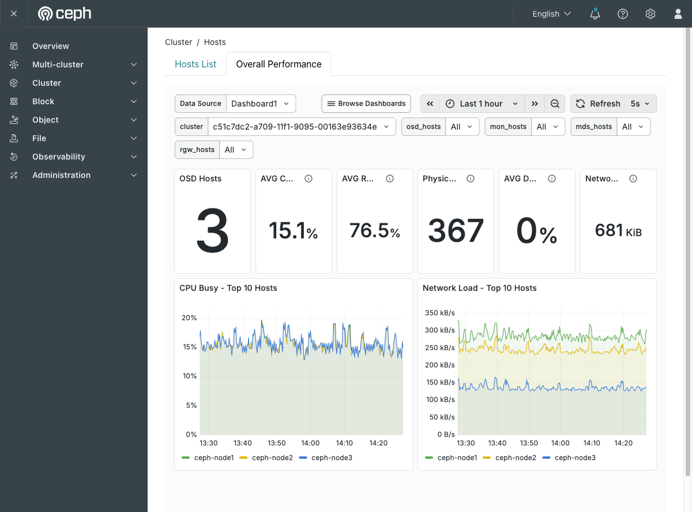
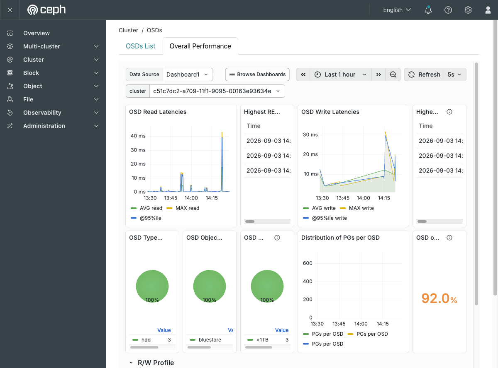
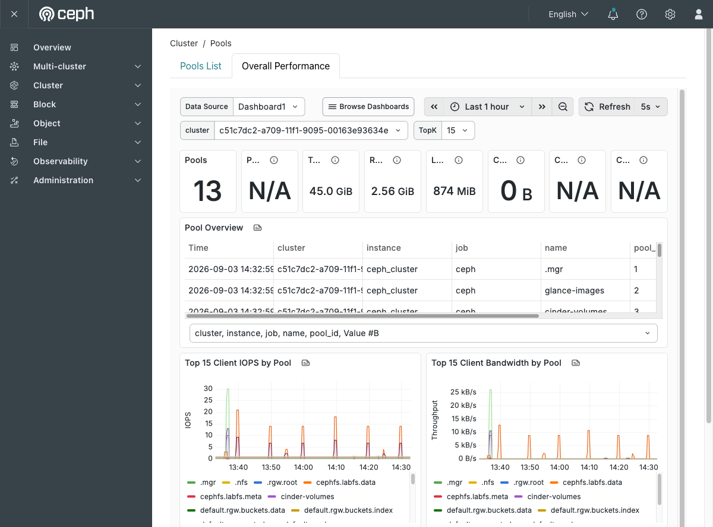
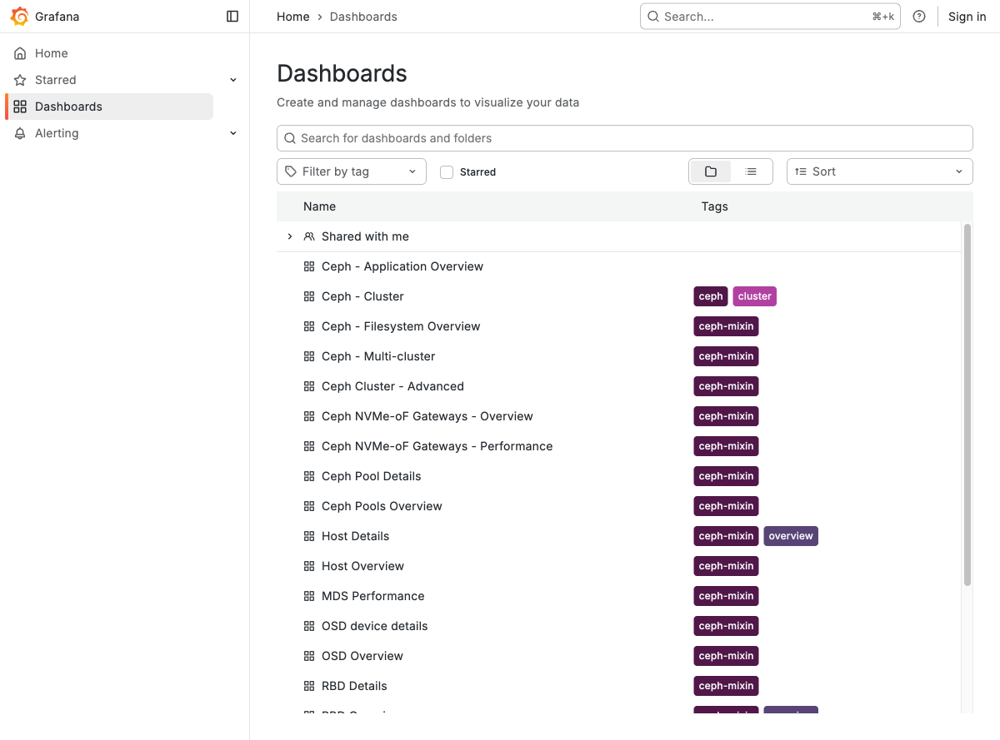
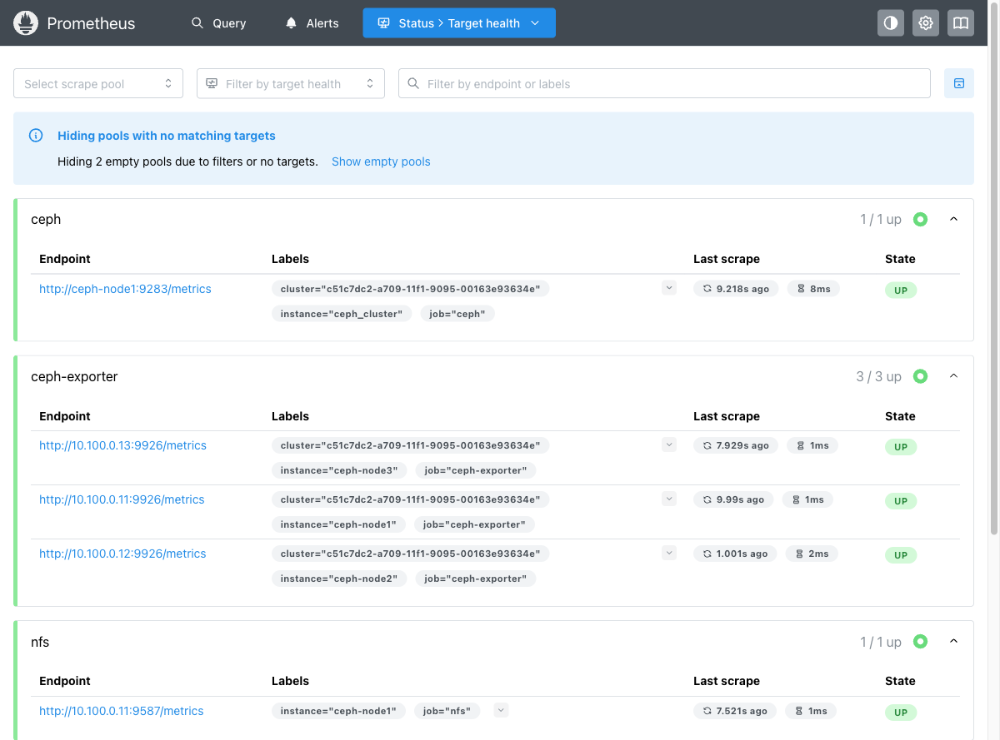
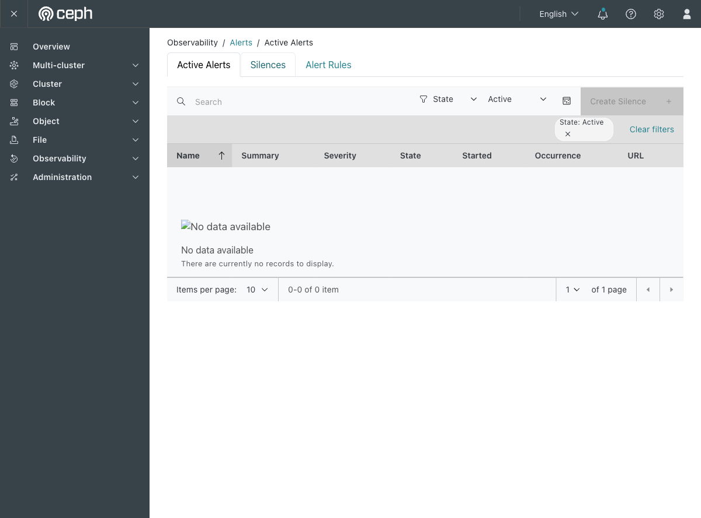
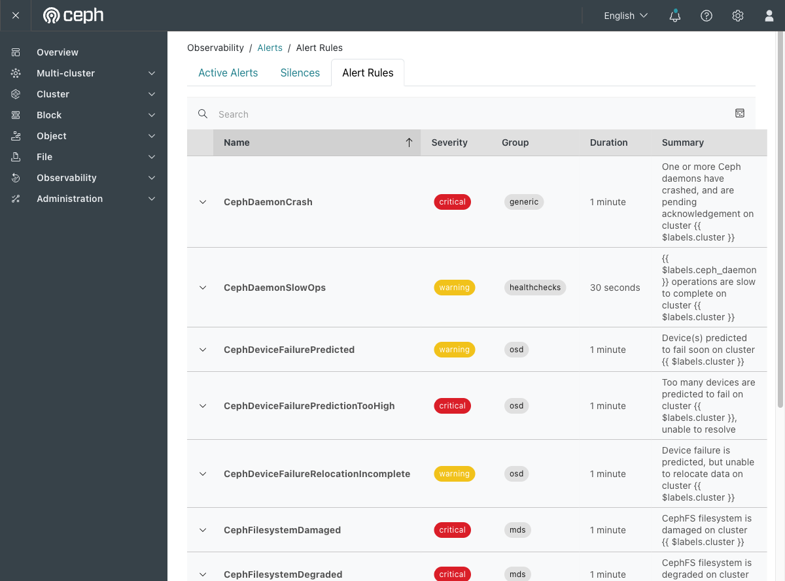
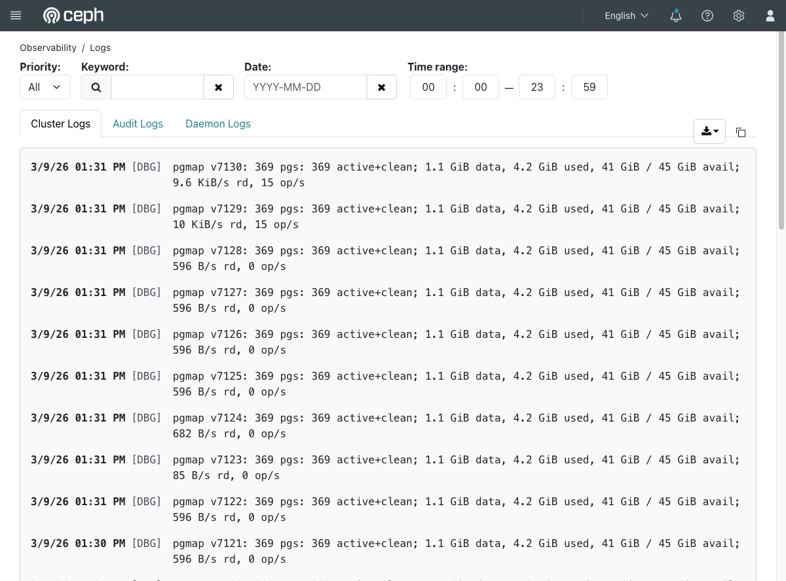

# Exercise 26 — The monitoring you already have (web UI)

Guide section: [Exercise 26](../openstack-ceph-lab-exercise.md#exercise-26--the-monitoring-you-already-have)

You want graphs of cluster throughput and OSD latency and you are about to install
Prometheus. You do not need to: `cephadm` deployed Grafana, Prometheus, Alertmanager,
node-exporter and ceph-exporter when it bootstrapped the cluster.

This exercise is almost entirely web UI, so it gets the most screenshots.

## Step 1 — The landing page

`https://<vm-ip>:8443/` → **Overview**.



Everything a status page should have, in one screen:

- **Details** — cluster ID, orchestrator, and the exact Ceph version (20.2.2 tentacle)
- **Status** — the health check, green here
- **Capacity** — 4.2 GiB of 45 GiB raw. This is raw, before replication; Exercise 24
  explains why the usable figure is much smaller
- **Cluster Utilization** — throughput, IOPS and OSD apply/commit latency over the last
  hour. These are the dashboard's own charts, drawn from the mgr module, not Grafana —
  which is why they work even when the Grafana panels below do not
- **Inventory** — hosts, monitors, OSDs, pools, gateways, each linking to its page

## Step 2 — Confirm the stack is really there

**Administration → Services.**



`alertmanager`, `ceph-exporter`, `grafana`, `node-exporter`, `prometheus` — five
services nobody installed, sitting next to the mons and OSDs. `node-exporter` and
`ceph-exporter` are `3 / 3` because they run on every host.

## Step 3 — Accept the Grafana certificate first

**Do this before opening any performance tab.** Visit `https://<vm-ip>:3000/` on its
own and accept the warning.

Grafana has its own self-signed certificate, separate from the dashboard's on 8443. The
dashboard shows Grafana's graphs in an iframe that *your browser* loads, so until the
browser trusts that certificate every "Overall Performance" tab looks like this — an
empty grey frame with a broken-document icon, and no error message anywhere, because
the dashboard never learns the browser refused a certificate it was not shown:

```
┌──────────────────────────────────────┐
│                                      │
│                 [X]                  │
│                                      │
└──────────────────────────────────────┘
```

This is the most confusing failure in the whole monitoring setup and it takes one click
to avoid. The same is true after a machine restart: the VM address changes, so it is a
new origin and a new exception.

## Step 4 — Hosts

**Cluster → Hosts → Overall Performance.**



This is Grafana's *Host Overview* dashboard in kiosk mode, embedded. OSD hosts, average
CPU and RAM, then CPU Busy and Network Load broken out per host — all three ceph nodes
plotted separately. The time range and refresh controls at the top are Grafana's, and
they work.

## Step 5 — OSDs

**Cluster → OSDs → Overall Performance.**



The one to know. Read and write latency with AVG, MAX and 95th percentile, the highest
recent latencies as a table, device class and backend breakdown, and the distribution
of PGs per OSD.

When someone says storage is "slow", this page either shows the spike or it does not,
and that single fact decides where you look next.

## Step 6 — Pools

**Cluster → Pools → Overall Performance.**



Top-K client IOPS and bandwidth per pool. Useful for the question the Pools list cannot
answer: not "how big is this pool" but "which pool is busy right now".

## Step 7 — Grafana on its own

`https://<vm-ip>:3000/dashboards`



The embedded views are three of about twenty pre-built dashboards. *Ceph Cluster -
Advanced*, *Ceph Pool Details*, *OSD device details*, *RBD Details*, *MDS Performance*,
*RGW Overview* and the rest are only reachable here.

Note the **Sign in** link rather than a login wall: cephadm enables anonymous viewing so
the dashboard's iframes work without credentials, which means you get read access too.

## Step 8 — Where the numbers come from

`http://<vm-ip>:9095/targets`



Every scrape target and its state: `ceph` 1/1, `ceph-exporter` 3/3, `nfs` 1/1, `node`
3/3, all UP, with the last scrape age and duration.

**Check this first when a Grafana panel is empty.** A panel with no data and a target
that is DOWN are the same fault, and only this page names it.

`http://<vm-ip>:9095/graph` takes PromQL directly:

```promql
ceph_cluster_total_used_bytes / ceph_cluster_total_bytes
```

returns `0.0923…` here — which is the 9.24% on the Overview capacity donut. If those
two disagree, one of them is stale.

## Step 9 — Alerting

**Observability → Alerts → Active Alerts.**



Empty, because the cluster is healthy. The page rendering at all is the proof
Alertmanager is reachable — before its proxy device existed, this tab errored.

**Alert Rules** is the tab worth reading.



89 rules Prometheus is already evaluating, each with a severity and a firing delay:
`CephDaemonCrash` (critical, 60s), `CephDaemonSlowOps` (warning, 30s), `CephMonDown`,
`CephPGsDamaged`, `CephDeviceFailurePredicted`.

`CephOSDNearFull` fires at 85% after five minutes. That is the alert that would have
caught [Exercise 28](ex28-full-cluster.md) while the cluster was still writable, rather
than at 95% when deletes had already become impossible.

**Nothing is delivered, though.** Alertmanager has no receiver configured, so every rule
fires into this page and stops. Wiring one up is the natural next step past this lab.

## Step 10 — Logs

**Observability → Logs.**



Three tabs, and the distinction matters when you are answering "who did this?":

- **Cluster Logs** — what the cluster did to itself: pgmap updates, scrub results,
  health transitions
- **Audit Logs** — who issued which command, including everything the dashboard does on
  your behalf
- **Daemon Logs** — per-daemon output

Filters for priority, keyword, date and time range sit above the tabs, and the icons on
the right export or copy the current view.

Metrics tell you something changed; these tell you what changed it.

## Do it with something happening

Re-run the [Exercise 21](ex21-lose-a-disk.md) failure drill with **Cluster → OSDs**
open. Watching the degraded-object count climb and drain away, and the latency panel
spike with it, is far more legible than reading `ceph -s` in a loop — and it is how you
will actually experience the real thing.
