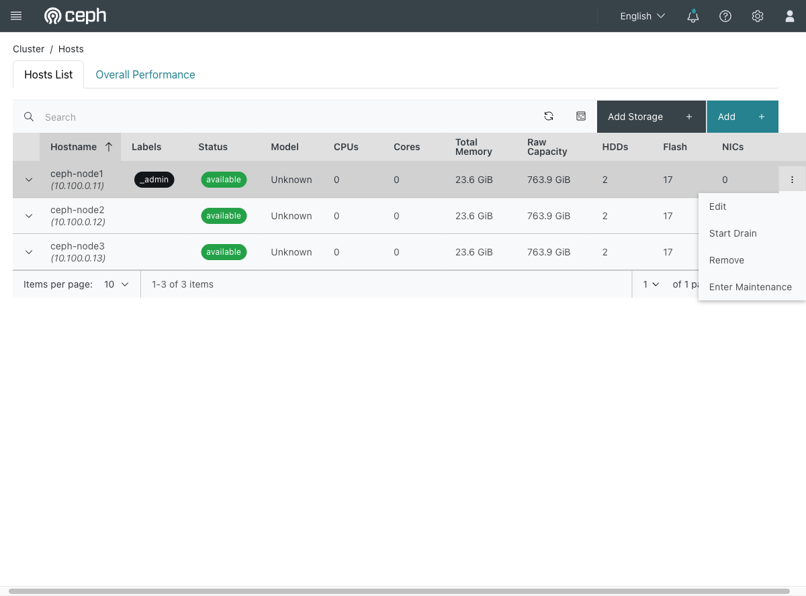

# Exercise 27 — Add a node, then take it away again (web UI)

Guide section: [Exercise 27](../openstack-ceph-lab-exercise.md#exercise-27--add-a-node-then-take-it-away-again)

The cluster is filling up and you have budget for another storage node. Later, that
node is decommissioned. Both directions are routine, and both leave things behind if
you stop at the obvious step — which is the real lesson.

## Step 1 — Adding

**Cluster → Hosts → Add.**

Hostname, network address, labels, and a maintenance-mode toggle for adding a host you
are not ready to use yet. The hostname field takes ranges
(`example-[01-03].ceph`) for adding a rack at a time.

**Labels are the part worth using.** cephadm places daemons by label, so labelling a
host `osd` or `mon` at add time is what makes the service specs pick it up. The
`_admin` label — visible on `ceph-node1` in the hosts list — is what puts a copy of
the admin keyring on that host.

Adding the host does not add OSDs. The disks come next, via **Cluster → OSDs →
Create**, or automatically if a service spec matches.

## Step 2 — Removing

Back on **Cluster → Hosts**, the host's ⋮ menu, in order:

1. **Start Drain** — moves daemons off the host and waits
2. **Remove** — takes it out of the cluster

## Step 3 — What gets left behind

This is the exercise. Removing a node the quick way leaves at least three things:

- **A stranded monitor in the monmap.** `ceph -s` reports `1/4 mons down` forever.
  Visible on **Cluster → Monitors**; fixed with `ceph mon rm <node>`.
- **Too many PGs per OSD.** Fewer OSDs, same PG count:
  `too many PGs per OSD (307 > 250)`. Either reduce PGs or raise the limit with
  `ceph config set global mon_max_pg_per_osd 400`.
- **A `CEPHADM_REFRESH_FAILED` warning**, from cephadm still trying to inventory a host
  that is gone.

None of these are errors while the cluster is otherwise healthy, and all of them are
still there weeks later when something else fails. Check **Cluster → Hosts**,
**Monitors** and the **Overview** health panel after any removal.
