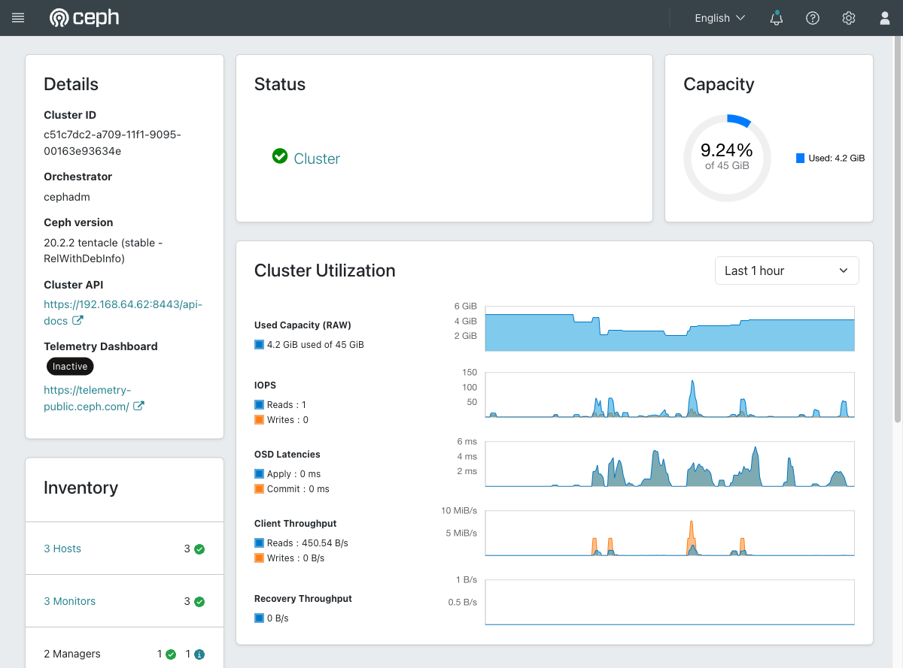

# Exercise 27 — Recover a cluster that has filled up (web UI)

Guide section: [Exercise 27](../openstack-ceph-lab-exercise.md#exercise-27--recover-a-cluster-that-has-filled-up)

A cluster at 95% stops accepting writes. The obvious fix — delete something — does not
work, because deletes are writes. This is a genuine incident that happened while
building this lab.

## Step 1 — Watch the number that matters

**Ceph dashboard → Overview.**



The Capacity donut is raw usage against raw total. Two thresholds sit above it, neither
of which appears on this page:

- **`nearfull_ratio` 0.85** — `HEALTH_WARN`, still writable
- **`full_ratio` 0.95** — writes are refused cluster-wide

**Cluster → OSDs** has the per-OSD version of the same figure, and that is the one to
watch: the cluster stops when the *fullest* OSD crosses the line, not when the average
does.

## Step 2 — Why you cannot just delete things

At `full_ratio` the cluster refuses writes, and `rbd rm` is a write. The escape is to
raise the ratio just far enough to let deletes through:

```bash
ceph osd set-full-ratio 0.99
# delete the offending images
ceph osd set-full-ratio 0.95      # put it back immediately
```

**These are not on the dashboard's Configuration page.** The full ratios live in the
OSD map, not the config database, so `full_ratio` does not appear under
**Administration → Configuration** at all. Searching for it there returns nothing —
that is expected, not a broken page.

## Step 3 — What filled it

In the incident that produced this exercise: a stuck 16 GiB snapshot plus a 3.5 GB
distro image. At `size = 3` that is 58 GiB of a 45 GiB cluster. Recovery took usage
from 95.74% back to 3.82%.

Two habits come out of it:

- **Multiply by the replication factor** before you write anything large. Exercise 23
  is the arithmetic.
- **Alert at `nearfull`, not at `full`.** Alertmanager already ships the rule
  (Exercise 25); it just has nowhere to send it.
